## 分布式系统的发展背景

### 1、 升级单机处理能力的性价比越来越低
单机的处理能力主要依靠 CPU、内存、磁盘IO速度。 

通过更换硬件做垂直扩展的方式来提升性能，成本会越来越高。

### 2、 单机处理能力存在瓶颈
单机处理能力存在瓶颈， CPU、内存都会有自己的性能瓶颈，硬件的发展速度和性能是有限制的。

### 3、稳定性和可用性这两个指标很难达到
单机系统存在可用性和稳定性的问题，这两个指标又是我们必须要去解决的。

## 分布式系统涉及的相关概念

#### 集群
将同1个系统部署到多个服务器上，每个服务器上提供的功能完全相同，这些服务节点则组成了一个集群。

集群中的每个节点所提供的功能的完全相同的。

#### 分布式
将1个系统按照业务拆分为若干个子系统，每个子系统完成一部分特定的功能，这些子系统间通过网络通信完成相互的调用，最终实现系统的完整功能。

分布式中的子系统，功能都是不同的，相互之间通过网络通信完成服务调用。

#### 节点
节点是指一个可以独立按照分布式协议完成一组逻辑的程序个体。 

在具体的项目中，一个节点表示的是一个操作系统上的进程。

#### 副本机制
副本(replica/copy)指在分布式系统中为数据或服务提供的冗余。

数据副本指在不同的节点上持久化同一份数据，当出现某一个节点的数据丢失时， 可以从副本上读取到数据。 数据副本是分布式系统中解决数据丢失问题的唯一手段。

#### 中间件
中间件位于操作系统提供的服务之外，又不属于应用， 位于应用和系统层之间，为了方便的处理系统间的通信、输入输出的一类软件的统称。

消息中间件 - Kafka，RocketMQ

数据库中间件 - MyCat，Sharding-JDBC 

---

## 分布式系统的演进过程

#### 阶段1，单体应用
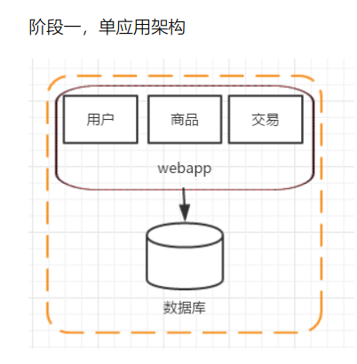

#### 阶段2，应用服务器和数据库服务器分离
随着网站的上线，访问量逐步上升，服务器的负载慢慢提高，在服务器还没有超载的时候，应该提取做好规划，提升网站的负载能力。

假如代码层面的优化已经没办法继续提高，在不提高单台机器的性能，增加机器是一个比较好的方式，投入产出比非常高。

这个阶段增加机器的主要目的是将 web 服务器和数据库服务器拆分，这样不仅提高了单机的负载能力，也提高了数据库的容灾能力。

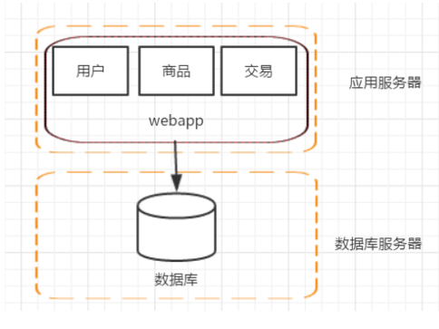

#### 阶段3，应用服务器集群化
随着访问量的继续增加，单台应用服务器已经无法满足需求。

在假设数据库服务器还没有遇到性能问题的时候，我们可以增加应用服务器，通过应用服务器集群将用户请求分流到各个服务器中，从而继续提升负载能力。

此时多台应用服务器之间没有直接的交互，他们都是依赖数据库各自对外提供服务。

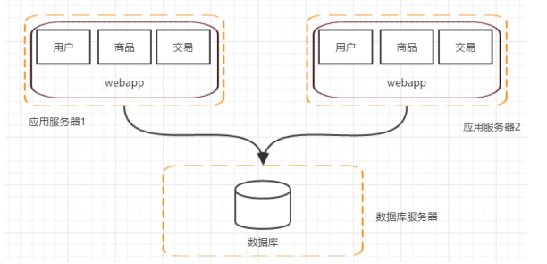

架构发展到这个阶段，各种问题也会慢慢呈现

	1. 用户请求由谁来转发到具体的应用服务器---负责均衡器
	2. 用户如果每次访问到的服务器不一样，那么如何维护session --- redis分布式缓存

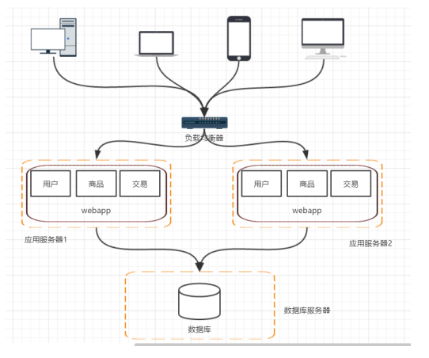

#### 阶段4，数据库读、写分离
数据库的负载也在慢慢增大，那么怎么去提高数据库层面的负载呢？

一般先考虑读写分离的方式。

这个架构的变化会带来几个问题

	1. 主从数据库之间的数据同步 ； 可以使用 mysql 自带的	master-slave 方式实现主从复制
	2. 数据源的选择 ； 采用第三方数据库中间件，例如 mycat

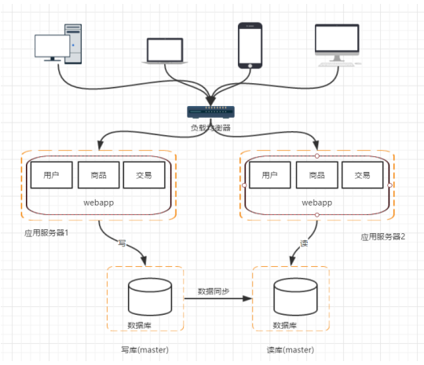

#### 阶段5，引入索引擎，缓解读库的压力

数据库做读库的话，对模糊查找效率不是特别好，像电商类的网站，搜索是非常核心的功能，即便是做了读写分离，这个问题也不能有效解决。

这个时候就需要引入搜索引擎了使用搜索引擎能够大大提高我们的查询速度，

但是同时也会带来一些附加的问题，比如维护索引的构建。

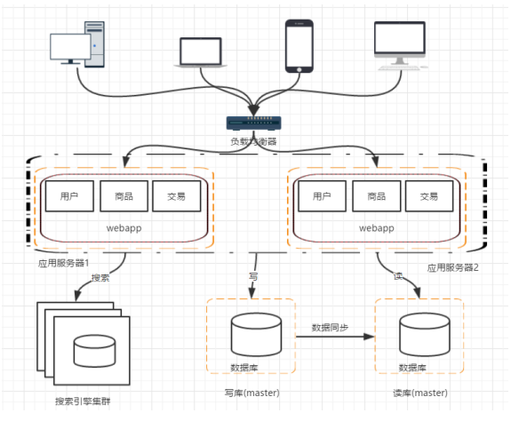

#### 阶段6，引入缓存机制，缓解数据库的压力
随着访问量的持续增加，逐渐出现热点数据（大量用户访问同一个数据），因此没必要每次都从数据库去读取，我们可以使用缓存技术，比如 memcache、 redis 来作为我们应用层的缓存；

另外在某些场景下，比如我们对用户的某些 IP的访问频率做限制，那这个放内存中又不合适，放数据库又太麻烦，这个时候可以使用Nosql 的方式，比如 mongDB 来代替传统的关系型数据库。

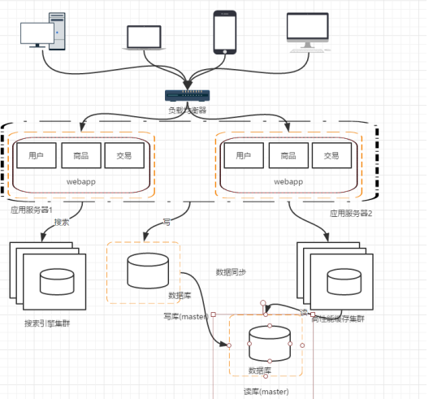

##### 阶段7，数据库的垂直/水平拆分
	垂直拆分：
		把数据库中不同业务数据拆分到不同的数据库。
		比如电商系统拆分出：用户库，商家库，订单库，支付库。
	
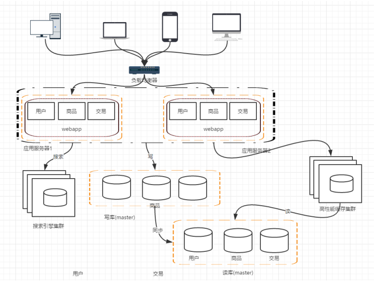

	水平拆分：
		把同一个表中的数据拆分到两个甚至跟多的数据库中，
		水平拆分的原因是某些业务数据量已经达到了单个数据库的瓶颈，这时可以采取讲表拆分到多个数据库中。

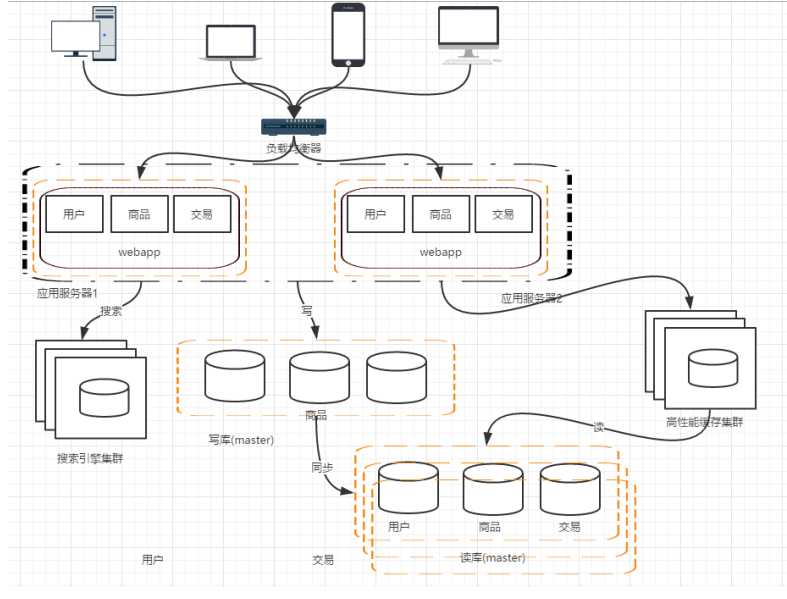

#### 阶段8，应用的拆分 - 分布式应用
随着业务的发展，业务越来越多，应用的压力越来越大，工程规模也越来越庞大。

这个时候就可以考虑对应用进行拆分，按照领域模型拆分出用户、商品、交易等多个子系统。

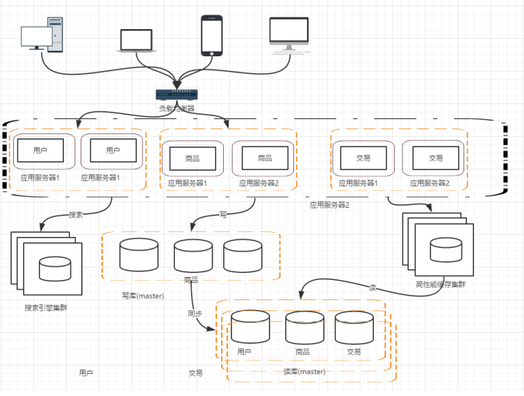

这样拆分以后，可能会有一些相同的代码，比如用户操作，在商品和交易都需要查询，所以会导致每个系统都会有用户查询访问相关操作。

这些相同的操作一定是要抽象出来，否则就会是一个坑。

所以需要走服务化路线的方式来解决。

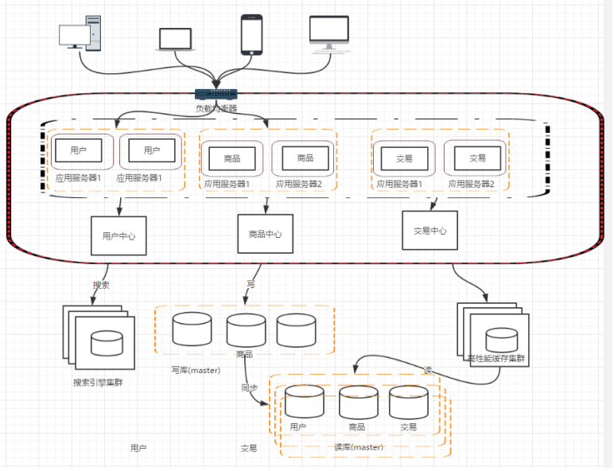

那么服务拆分以后，各个服务之间如何进行远程通信呢？

通过 RPC 技术，比较典型的有： webservice、 hessian、 http、 RMI等等

前期通过这些技术能够很好的解决各个服务之间通信问题， but，互联网的发展是持续的，所以架构的演变和优化还在持续。--- dubbo应运而生！

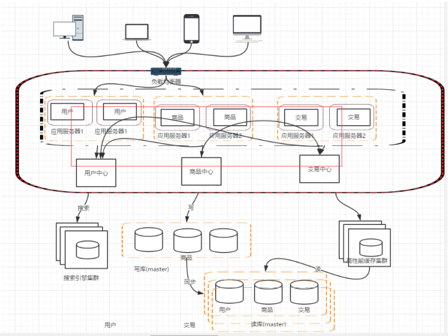

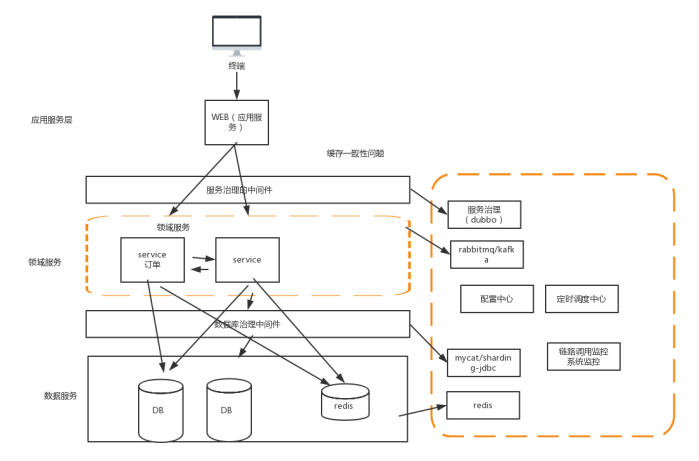