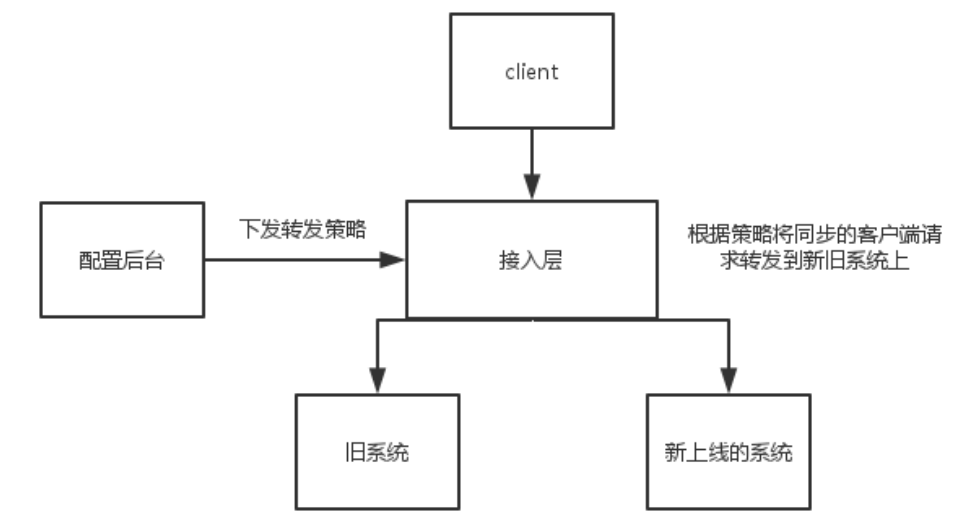

# 分布式系统的高可用性设计思路

## 1、避免单点故障
	a) 负载均衡技术
		硬件负载（F5）
		软件负载（Nginx）
		去中心化的负载均衡（比如RedisCluster实现的数据分布式存储）
	b) 热备（linux HA）
	c) 多机房（同城灾备、 异地灾备）

## 2、应用的高可用性
	a) 故障监控（系统监控（cpu、 内存） /链路监控/日志监控）自动预警
	b) 应用的容错设计、（服务降级、 限流） 自我保护能力
	c) 数据量（数据分片、 读写分离）

## 3、分布式架构下的可伸缩设计
	垂直伸缩： 提升单机的硬件性能
	水平伸缩： 增加更多服务器

## 4、加速静态内容访问速度的 CDN
CDN 是 Content Delivery Network 的缩写，表示的是内容分发网络。 

CDN 的作用是把用户需要的内容分发到离用户最近的地方，这样可以是用户能够快熟获取所需要的内容。

CDN 其实就是一种网络缓存技术，能够把一些相对稳定的资源放到距离最终用户较近的地方，一方面可以节省整个广域网的带宽消耗，另外一方面可以提升用户的访问速度，改进用户体验。

我们一般会把静态的文件（图片、脚本、静态页面）放到 CDN 中。

## 5、灰度发布

灰度发布系统的作用在于，可以根据自己的配置，来将用户的流量导到新上线的系统上，来快速验证新的功能修改，而一旦出问题，也可以马上的恢复，简单的说，就是一套A/BTest 系统．

