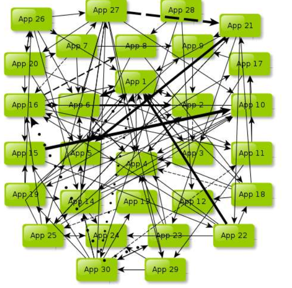
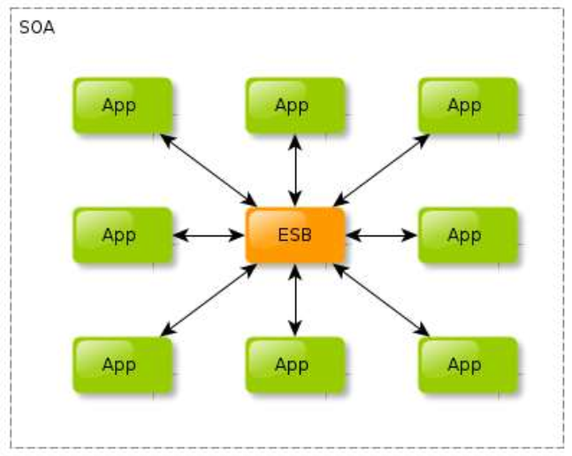

## SOA - Service Oriented Architecture
面向服务的架构， 整个系统包含多个服务，服务之间通过相互依赖最终提供一系列的功能。	

#### SOA中的ESB
跟 SOA 紧密相关的还有一个 ESB（企业服务总线）。

简单来说 ESB 就是一根管道，用来连接各个服务节点。

为了集成不同系统，不同协议的服务， ESB 做了消息的转化解释（不同协议，不同数据格式等）和路由工作，让不同的服务互联互通。

#### SOA 所解决的核心问题
###### 1、系统集成 - ESB 消息总线，解决服务调用的问题
站在系统的角度，解决企业系统间的通信问题，把原先散乱、无规划的系统间的网状结构，梳理成规整、可治理的系统间星形结构，

这一步往往需要引入一些产品，比如 ESB、以及技术规范、服务管理规范；

这一步解决的核心问题是【有序】

###### 2、系统的服务化 - 功能的可复用
站在功能的角度，把业务逻辑抽象成可复用、可组装的服务，通过服务的编排实现业务的快速再生，目的：把原先固有的业务功能转变为通用的业务服务，实现业务逻辑的快速复用；

这一步解决的核心问题是【复用】

###### 3、业务的服务化 - 业务的可复用
站在企业的角度，把企业职能抽象成可复用、可组装的服务； 

把原先职能化的企业架构转变为服务化的企业架构，进一步提升企业的对外服务能力； 

“前面两步都是从技术层面来解决系统调用、系统功能复用的问题”。

第三步，则是以业务驱动把一个业务单元封装成一项服务，这一步解决的核心问题是【高效】

---
## 微服务
微服务是在 SOA 上做的升华，微服务架构强调的一个重点是“业务需要彻底的组件化和服务化”，

原有的单个业务系统会拆分为多个可以独立开发、设计、运行的小应用。

这些小应用之间通过服务完成交互和集成。

#### 微服务的特征
	通过服务实现组件化
	按业务能力来划分服务和开发团队
	去中心化
	基础设施自动化（devops、自动化部署）

---

## SOA 和微服务架构的差别

1、微服务不再强调传统 SOA 架构里面比较重的 ESB 企业服务总线，微服务将 SOA 中服务化的思想进一步深入到单个业务系统内部，实现真正的组件化。

2、Docker 容器技术的出现，为微服务提供了更便利的条件，比如更小的部署单元，每个服务可以通过类似 Node或者 Spring Boot 等技术运行在独立的进程中。

3、SOA 注重的是系统集成方面，而微服务关注的是完全分离。
