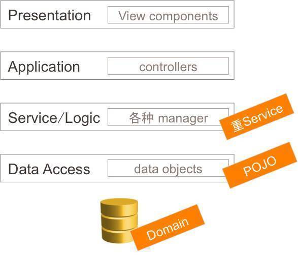
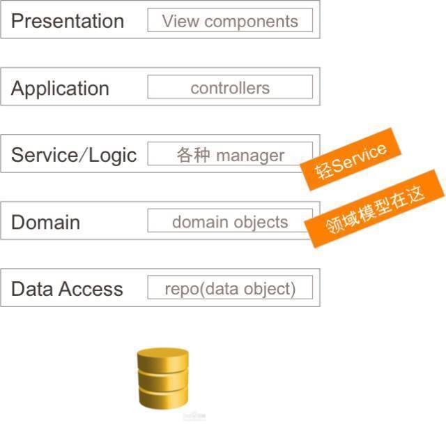
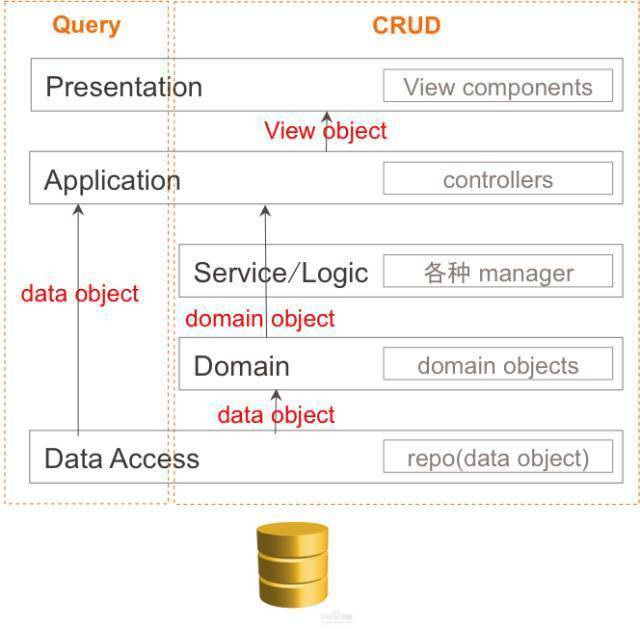

## DDD - Domain-Driven Design 领域驱动设计

## 什么是领域驱动设计？
设计一个软件或功能时，首先需要了解产品的功能，进行大量业务知识的梳理。在对业务知识的理解过程中，也就形成了该领域的相关知识，基于领域知识再一步步驱动软件设计，就是所谓的领域驱动设计。

> 核心：领域，即与行业相关的Domain Object 的功能
	

## 通过领域来驱动设计的好处是什么？
##### 非领域设计的开发方式：
系统功能由1个独立的service封装所有业务逻辑操作，或者组合若干个service来完成。

由于service的主要目的是实现业务逻辑，随着业务需求的变更，不得不在原来的service上进行修改，一方面会让代码更复杂，另一方面也可能引入额外的功能，使得service层的功能耦合度不断上升，系统维护越来越困难。

这种设计方式，在功能简单的系统中不会造成太大问题。但是，对于复杂系统，尤其是需求在不断变化的场景下，就会引发后期维护困难的问题。service的职责太重，一个小小的变化都可能引起大量代码的修改。究其本质，就是原本属于领域内部的功能，本应在领域内部进行实现或升级，但是被不断扩散到外部所致。

##### 基于领域设计的开发方式：
按领域来实现系统各部分的功能，不同领域实现不同的功能，领域之间可独立演进。

由于已经明确了基于领域进行设计开发，那前期就会把领域相关的功能封装到领域内部区完成，不会扩散到领域之外。

通过 DDD 可以将系统解构更加合理，最终满足高内聚低耦合的本质。

根据业务功能，按领域将功能拆分到不同的子领域，由每个子域实现相关的功能。

---

## 领域拆分怎么做？

---

## 领域模型设计：基于数据库 VS 基于对象
	
	设计上有两种维度入手：
		Data Modeling - 通过数据来抽象系统关系，侧重于数据库的设计
		Object Modeling - 通过面向对象方式抽象系统关系，侧重于对象关系建模
	
### Data Model

早期的领域模型就是数据库设计. 我们做传统项目的流程或者说包括现在我们做项目的流程，都是首先讨论需求，然后是数据库建模， 在需求逐步确定的过程不断的去更新数据库的设计。接着我们在项目开发阶段，发现有些关系没有建、有些字段少了、有些表结构设计不合理，又在不断的去调整设计。最后上线。在传统项目中，数据库是整个项目的根本，数据模型出来以后后续的开发都是围绕着数据展开；

在这种情况下，领域模型的设计其实就是做数据库设计。

在service层通过各种Manager来负责大部分的逻辑，POJO(失血模型)作为数据被manager处理（并进行各种转换）。

service层在这里是很重的一层，所有逻辑处理基本都放在 service 层，围绕着数据库提供的数据进行操作。

随着业务变得复杂以后，包括数据结构的变化，那么各个模块就需要进行修改，原本清晰的系统经过不断的演化变得复杂、冗余、耦合度高。

### Object Model

service层基于这些领域模型进行操作（service变薄了，很多工作交给了domain objects来处理），
领域模型并不负责业务逻辑的处理，每个domain object都有自己应有的职责（single responsibility）。

比如person.run()是一个与业务无关的行为，但service或manager可以让person跑100米，或者让person跑去送外卖。

在object modeling的设计下，数据库的职责不再承担领域建模的承重负担，数据库回归persistence的本质。完成两件事情：
	存：将对象数据持久化到存储介质中
	取：高效的把数据查询返回到内存中

由于数据库不再承担领域建模的重任，数据库的设计也就变得灵活起来，任何可以加速存储和搜索的技术都可以被应用上。

在object modeling的前提下，数据库设计要尽可能高效存取，而不是完美表达领域模型。

领域模型是用于领域操作的，但是避免不了需要涉及到复杂查询的情况。

对于复杂查询的处理，都应该绕过domain层，在上层Application直接与数据库完成交互查询。

	领域操作 -> objects
	数据查询 -> table rows

---
## DDD 中的一些名词

##### 实体 Entity
当一个对象由其标识（而不是属性）区分时，这种对象称为实体（Entity）。

##### 值对象 Value Object
当一个对象用于对事物进行描述而没有唯一标识时，它被称作值对象。

值对象没有唯一标识，不存在这个值对象或那个值对象的说法。

##### 聚合根 Aggregate
聚合根属于实体对象， 它是领域对象中一个高度内聚的核心对象。

聚合根具有全局的唯一标识，而实体只有在聚合内部有唯一的本地标识。

##### 领域服务	Service
一些重要的领域行为或操作，可以归类为领域服务。

它实现了全部业务逻辑并且通过各种校验手段保证业务的正确性。

##### 资源库 Repository
Repository封装了基础设施来提供查询和持久化聚合操作，不是数据库的封装，而是领域层与基础设施之间的桥梁。

这样能够让我们始终关注在模型层面，把对象的存储和访问都委托给资源库来完成。

DDD 关心的是领域内的模型，而不是数据库的操作。

---
## 领域模型：失血模型、贫血模型、充血模型

#### 失血模型
基于数据库的领域设计方式，其实就是典型的失血模型。

Java中简单的POJO，只有基于field的getter,setter方法，POJO之间的关系隐藏在对象的某些xxxId字段上，由外部的manager或service来解释该字段并进行使用。

比如，Son中的fatherId就是一个维护son与father关系的字段。

#### 贫血模型
领域模型更丰富一些，除了基本的getter,setter方法之外，还有一些其它的方法。

比如，Son中不再通过fatherId来维护关系，而是直接持有一个Father对象的引用。与此类似的，Father中也持有Son的引用。

但是，仔细分析会发现这里存在一个循环引用的问题，Son与Father在构造时都需要对方的实例！为了解决循环依赖的问题，需要在一方取消对方的引用，采用一种间接的方法进行引用。

比如，在Father中通过sonRepository来获得Son对象。这样在构造Father的时候，就不需要构造一个Son对象，代价就是必须在Father中引入一个SonRepository，这也就是在domain中引入了持久化操作，也就是下面要说的充血模型。

#### 充血模型
充血模型的存在让domain object失去了血统的纯正性，它不再是一个纯的内存对象，这个对象里需要进行数据库的操作。

比如，在Father中持有Son的引用，但是对Son的赋值是通过sonRepository查询得到的。也就是在一个domain中引用了一个持久化操作，这就是所说的充血模型。

