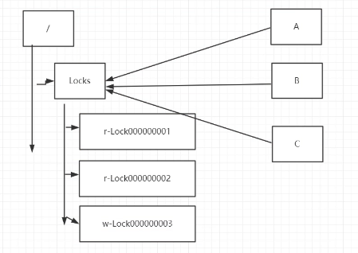

## 分布式锁

####1）redis的实现方案： 
 setnx 保证只有1个客户端能设置成功。
####2）数据库的实现方案： 
	1、创建一个表， 通过索引唯一的方式
	create table (id , methodname …)   methodname增加唯一索引
	insert 一条数据XXX   delete 语句删除这条记录  （弊端：delete失败会导致其它客户端无法获取到锁）
	
	2、mysql  for update 设置行锁

####3）zookeeper的实现方案：
排他锁（写锁）：在/locks目录下创建**临时且有序**节点。

	每个客户端判断当前是否为最小的编号，如果是，则为获取到锁。
	watch当前节点的前一个节点的状态，当前一个节点删除时，获得通知，如果最小编号等于当前客户端创建的编号，则表示当前客户端成功获取到锁。

共享锁（读锁）：在同一个目录下创建**临时且有序**节点。

	r-xxxx 表示客户端需要进行读操作。
		对于r-xxxxx的客户端，如果所有小于它的节点编号的节点都是读操作，则该客户端可以进行读操作。
	w-xxxx表示客户端需要进行写操作。
		对于w-xxxxx的客户端，直到所有小于它的节点编号的节点都删除后，才能开始写操作（等待读操作完成）。

#### 4) Curator实现
java提供synchronized或者ReentrantLock来解决同一个JVM虚拟机内部多线程的并发同步问题。

分布式锁则是解决不同JVM进程之间的线程同步问题！

Curator提供了**InterProcessMutex**来解决分布式锁的问题。

---
》》》Curator更多的封装

##### 分布式场景下进行全局计数器 - Curator实现
Curator提供了**DistributedAtomicInteger**来解决分布式系统全局计数器的功能。

##### 分布式场景下的Barrier - Curator实现
Curator提供了**DistributedBarrier**来实现分布式系统间线程的协调控制功能。
	DistributedBarrier 同时启动任务
	DistributedDoubleBarrier 同时启动任务，同时结束任务

##### Curator提供的分布式队列
	DistributedQueue
	DistributedDelayQueue
	DistributedPriorityQueue