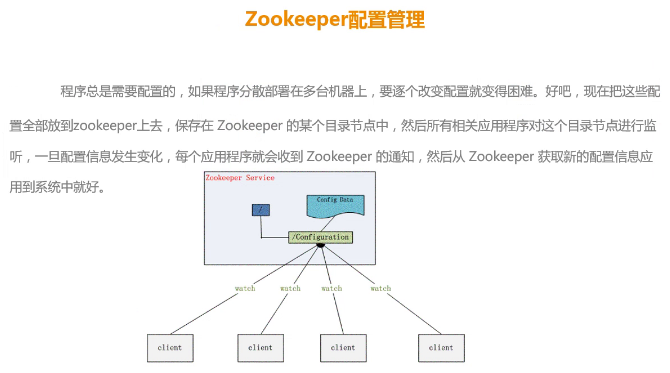

### 全局配置管理（开关、注册中心等）

配置的管理在分布式应用环境中很常见。

比如在平常的应用系统中，会有这样的需求：机器的配置列表，运行时的开关，数据库的配置信息、服务地址等。

将系统的各种配置参数抽取出来，在一个地方集中维护，是比较好的方式。

比如，将redis相关参数，数据库的相关参数等通过zk进行配置，以便实现动态更新配置，提高系统的可配置性。（在配置文件中用固定参数的写法是不推荐的）

---

实现配置信息的集中式管理和数据的动态更新。（另，百度开源的配置管理-disconf）

这些全局配置信息通常具备3个以下特性：

	1.数据量比较小；
	2.数据内容在运行时会发生动态变更；
	3.集群中的各个机器共享配置，确保配置的一致性。

实现配置中心有两种模式：push 、pull。

	pull: 客户端使用长轮训或定时任务，从配置中心读取最新的配置。
	push: 客户端先注册监听，当配置发生变化时，推送更新给客户端。

zookeeper采用的是推拉相结合的方式。 

	客户端向服务器端注册自己需要关注的节点。
	一旦节点数据发生变化，那么服务器端就会向客户端。
	发送watcher事件通知。客户端收到通知后，主动到服务器端获取更新后的数据。

###### 比如， 分布式日志收集的目录配置
做一个日志系统收集集群中所有节点的日志，进行日志收集的统一管理。

比如使用zookeeper配置不同类型的日志分别从节点的哪个目录进行采集。

