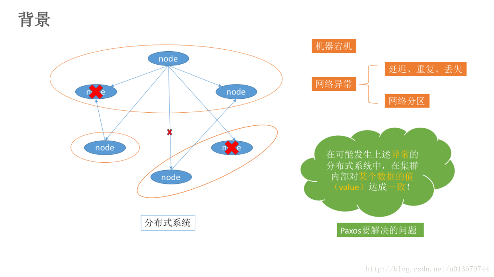
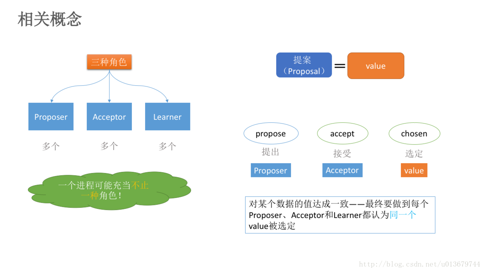

# Paxos 一种基于消息传递的一致性算法

## Paxos是什么
Paxos算法是莱斯利·兰伯特(Leslie Lamport)1990年提出的一种基于消息传递的一致性算法。

## Paxos算法 - 克服分布式环境下的各种异常，实现数据一致性
Paxos算法是基于消息传递且具有高度容错特性的一致性算法，是目前公认的解决分布式一致性问题最有效的算法之一，其解决的问题就是在分布式系统中如何就某个值（决议）达成一致。

在常见的分布式系统中，总会发生诸如机器宕机或网络异常（包括消息的延迟、丢失、重复、乱序，还有网络分区）等情况。Paxos算法需要解决的问题就是如何在一个可能发生上述异常的分布式系统中，快速且正确地在集群内部对某个“数据”的值达成一致。也可以理解成分布式系统中达成状态的一致性。

不仅仅是分布式系统中，**凡是多个过程需要达成某种一致的场合都可以使用Paxos 算法**。

一致性算法可以通过共享内存（需要锁）或者消息传递实现，Paxos 算法采用的是后者。
	
	1、一台机器中多个进程/线程达成数据一致；
	2、分布式文件系统或者分布式数据库中多客户端并发读写数据；
	3、分布式存储中多个副本响应读写请求的一致性。
	

## 拜占庭问题
拜占庭将军问题：是指拜占庭帝国军队的将军们必须全体一致的决定是否攻击某一支敌军。问题是这些将军在地理上是分隔开来的，只能依靠通讯员进行传递命令，但是通讯员中存在叛徒，它们可以篡改消息，叛徒可以欺骗某些将军采取进攻行动；促成一个不是所有将军都同意的决定，如当将军们不希望进攻时促成进攻行动；或者迷惑某些将军，使他们无法做出决定。

Paxos算法的前提假设是不存在拜占庭将军问题，即：信道是安全的（信道可靠），发出的信号不会被篡改，因为Paxos算法是基于消息传递的。此问题由Lamport提出，它也是 Paxos算法的提出者。
从理论上来说，在分布式计算领域，试图在异步系统和不可靠信道上来达到一致性状态是不可能的。因此在对一致性的研究过程中，都往往假设信道是可靠的，而事实上，大多数系统都是部署在一个局域网中，因此消息被篡改的情况很罕见；另一方面，由于硬件和网络原因而造成的消息不完整问题，只需要一套简单的校验算法即可。因此，在实际工程中，可以假设所有的消息都是完整的，也就是没有被篡改。

##Paxos算法的相关概念
在Paxos算法中，有三种角色：

	Proposer
	Acceptor
	Learners

在具体的实现中，一个进程可能同时充当多种角色。比如一个进程可能既是Proposer又是Acceptor又是Learner。Proposer负责提出提案，Acceptor负责对提案作出裁决（accept与否），learner负责学习提案结果。

## Paxos算法的过程（算法描述）
Paxos算法类似于两阶段提提交，其算法执行过程分为两个阶段。具体如下：
#####阶段一（prepare阶段）：
(a) Proposer选择一个提案编号N，然后向半数以上的Acceptor发送编号为N的Prepare请求：Pareper（N）。

(b) 如果一个Acceptor收到一个编号为N的Prepare请求，如果小于它已经响应过的请求，则拒绝，不回应或回复error。若N大于该Acceptor已经响应过的所有Prepare请求的编号（maxN），那么它就会将它已经接受过（已经经过第二阶段accept的提案）的编号最大的提案（如果有的话，如果还没有的accept提案的话返回{pok，null，null}）作为响应反馈给Proposer，同时该Acceptor承诺不再接受任何编号小于N的提案。

####阶段二（accept阶段）：
(a) 如果一个Proposer收到半数以上Acceptor对其发出的编号为N的Prepare请求的响应，那么它就会发送一个针对[N,V]提案的Accept请求给半数以上的Acceptor。注意：V就是收到的响应中编号最大的提案的value（某个acceptor响应的它已经通过的{acceptN，acceptV}），如果响应中不包含任何提案，那么V就由Proposer自己决定。

(b) 如果Acceptor收到一个针对编号为N的提案的Accept请求，只要该Acceptor没有对编号大于N的Prepare请求做出过响应，它就接受该提案。如果N小于Acceptor以及响应的prepare请求，则拒绝，不回应或回复error（当proposer没有收到过半的回应，那么他会重新进入第一阶段，递增提案号，重新提出prepare请求）。

### Paxos算法引入了过半的概念，另外Paxos算法支持分布式节点角色之间的轮换，这极大避免了分布式单点的出现，因此Paxos算法既解决了无限等待问题，也解决了脑裂问题，是目前来说最优秀的分布式一致性算法。