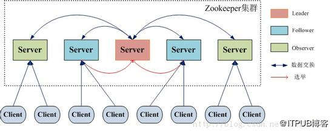
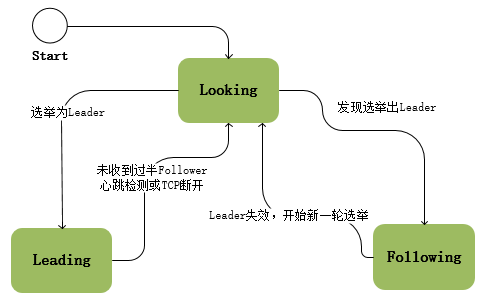

## Zookeeper的核心：ZAB原子消息广播协议
拜占庭问题：多支军队如何在消息可能丢失的情况下确保对同一个目标发起进攻的问题。

# [ZAB协议概述](https://blog.csdn.net/u013679744/article/details/79240249)

事实上zookeeper并没有采用完全的Paxos算法，而是采用了一种称为Zookeeper Atomic Broadcast(ZAB，zookeeper原子消息广播协议)。

ZAB 协议是为ZooKeeper 专门设计的一种支持崩溃恢复的原子广播协议。

Zookeeper使用一个单一主进程来接收并处理客户端的所有事务请求，并采用ZAB的原子广播协议，将服务器数据的状态变更以事务Proposal的形式广播到所有的Follower上。

Zookeeper 客户端会随机连接到 Zookeeper 集群的一个节点，如果是读请求，就直接从当前节点中读取数据；如果是写请求且当前节点不是leader，那么节点就会向 leader 提交事务，leader 会广播事务，只要有超过半数节点写入成功，该写请求就会被提交（类 2PC 协议）。

ZAB可以说是在Paxos算法基础上进行了扩展改造而来的，ZAB协议设计了支持崩溃恢复，

ZooKeeper使用单一主进程Leader用于处理客户端所有事务请求，采用ZAB协议将服务器数状态以事务形式广播到所有Follower上；

ZAB协议能够保证一个全局的变更序列。
由于事务间可能存在着依赖关系，ZAB协议保证Leader广播的变更序列被顺序的处理：一个状态被处理那么它所依赖的状态也已经提前被处理；

ZAB协议支持的崩溃恢复可以保证在Leader进程崩溃的时候可以重新选出Leader并且保证数据的完整性；

在ZooKeeper中所有的事务请求都由一个主服务器也就是Leader来处理，其他服务器为Follower，Leader将客户端的事务请求转换为事务Proposal，并且将Proposal分发给集群中其他所有的Follower，然后Leader等待Follwer反馈，当有过半数（>=N/2+1）的Follower反馈信息后，Leader将再次向集群内Follower广播Commit消息，Follower将之前的Proposal提交，实现数据一致性。

# 一、ZAB 中的节点有三种状态
	
ZAB协议中存在着三种状态，每个节点都属于以下三种中的一种：

	1. Looking（发现）：系统刚启动时或者Leader崩溃后正处于选举状态
	2. Following（同步）：Follower节点所处的状态，Follower与Leader处于数据同步阶段；
	3. Leading（领导）：Leader所处状态，当前集群中有一个Leader为主进程；

在ZooKeeper的整个生命周期中每个节点都会在Looking、Following、Leading状态间不断转换；

ZooKeeper启动时所有节点初始状态为Looking，这时集群会尝试选举出一个Leader节点，选举出的Leader节点切换为Leading状态；

当节点发现集群中已经选举出Leader则该节点会切换到Following状态，然后和Leader节点保持同步；

当Follower节点与Leader失去联系时Follower节点则会切换到Looking状态，开始新一轮选举；

Leader节点与Follower节点使用心跳检测来感知对方的存在；

当Leader节点在超时时间内收到来自Follower的心跳检测那Follower节点会一直与该节点保持连接；

若超时时间内Leader没有接收到来自过半Follower节点的心跳检测或TCP连接断开，那Leader会结束当前周期的领导，切换到Looking状态，所有Follower节点也会放弃该Leader节点切换到Looking状态，然后开始新一轮选举；

#### 事务ID的概念
在 ZAB 协议的事务编号 Zxid 设计中，Zxid 是一个 64 位的数字，其中低 32 位是一个简单的单调递增的计数器，针对客户端每一个事务请求，计数器加 1；而高 32 位则代表 Leader 周期 epoch 的编号，每个当选产生一个新的 Leader 服务器，就会从这个 Leader 服务器上取出其本地日志中最大事务的ZXID，并从中读取 epoch 值，然后加 1，以此作为新的 epoch，并将低 32 位从 0 开始计数。

epoch：可以理解为当前集群所处的年代或者周期，每个 leader 就像皇帝，都有自己的年号，所以每次改朝换代，leader 变更之后，都会在前一个年代的基础上加 1。这样就算旧的 leader 崩溃恢复之后，也没有人听他的了，因为 follower 只听从当前年代的 leader 的命令。

ZAB使用epoch来区分不同的Leader周期；

# 二、ZAB协议的两种基本模式：崩溃恢复模式、消息广播模式。 
当系统启动或leader服务器出现故障时，进入故障恢复模式，将会开启新的一轮选举，选举产生的leader会与过半的follower进行同步，使数据一致，当与过半的机器同步完成后，就退出恢复模式，进入消息广播模式。

##### 》》》 1、崩溃恢复（Leader选举）
ZAB协议会让ZK集群进入崩溃恢复模式的情况如下：

	（1）当服务框架在启动过程中
	（2）当Leader服务器出现网络中断，崩溃退出与重启等异常情况。
	（3）当集群中已经不存在过半的服务器与Leader服务器保持正常通信。

当leader挂掉后，集群无法进行工作，所以需要一个高效且可靠的leader选举算法。zk的实现是FastLeaderElection算法。

Leader选举需要达到的再次使用的条件，需要解决以下两个问题：

	1、已经被leader提交的事务需要最终被所有的机器提交（已经发出commit了）
	2、丢弃那些只在leader上提出的事务。（只在leader上提出了proposal，还没有收到回应，还没有进行提交）

##### 已经被Leader处理的消息不能丢（commit的）
这一情况会出现在以下场景：

当 leader 收到合法数量 follower 的 ACKs 后，就向各个 follower 广播 COMMIT 命令，同时也会在本地执行 COMMIT 并向连接的客户端返回「成功」。但是如果在各个 follower 在收到 COMMIT 命令前 leader 就挂了，导致剩下的服务器并没有执行都这条消息。

为了实现已经被处理的消息不能丢这个目的，Zab 的恢复模式使用了以下的策略：
选举拥有 proposal 最大值（即 zxid 最大） 的节点作为新的 leader：由于所有提案被 COMMIT 之前必须有合法数量的 follower ACK，即必须有合法数量的服务器的事务日志上有该提案的 proposal，因此，只要有合法数量的节点正常工作，就必然有一个节点保存了所有被 COMMIT 消息的 proposal 状态。

新的 leader 将自己事务日志中 proposal 但未 COMMIT 的消息处理。
新的 leader 与 follower 建立先进先出的队列， 先将自身有而 follower 没有的 proposal 发送给 follower，再将这些 proposal 的 COMMIT 命令发送给 follower，以保证所有的 follower 都保存了所有的 proposal、所有的 follower 都处理了所有的消息。

通过以上策略，能保证已经被处理的消息不会丢。

##### 被丢弃的消息不能再次出现
这一情况会出现在以下场景：
当 leader 接收到消息请求生成 proposal 后就挂了，其他 follower 并没有收到此 proposal，因此经过恢复模式重新选了 leader 后，这条消息是被跳过的。 此时，之前挂了的 leader 重新启动并注册成了 follower，他保留了被跳过消息的 proposal 状态，与整个系统的状态是不一致的，需要将其删除。

Zab 通过巧妙的设计 zxid 来实现这一目的。一个 zxid 是64位，高 32 是纪元（epoch）编号，每经过一次 leader 选举产生一个新的 leader，新 leader 会将 epoch 号 +1。低 32 位是消息计数器，每接收到一条消息这个值 +1，新 leader 选举后这个值重置为 0。

当旧的 leader 作为 follower 接入新的 leader 后，新的 leader 会让它将所有的拥有旧的 epoch 号的未被 COMMIT 的 proposal 清除。

##### 》》》 2、消息广播
当集群中已经有过半的follower与leader服务器完成了状态同步，那么整个zk集群就可以进入消息广播模式了。
如果集群中的其他节点收到客户端地事务请求，那么这些非leader服务器会首先将这个事务请求转发给leader服务器。

ZAB协议的消息广播过程使用的是一个原子广播协议，类似于一个2PC提交过程，针对每个客户端的事务请求，leader服务器会为其生成对应的事务Proposal，并将其发送给集群中其余所有的机器，然后再分别收集各自的选票，最后进行事务提交。

	Leader 接收到消息请求后，将消息赋予一个全局唯一的 64 位自增 id，叫做：zxid，通过 zxid 的大小比较即可实现因果有序这一特性。

	Leader 通过先进先出队列（会给每个follower都创建一个队列，保证发送的顺序性），将带有 zxid 的消息作为一个提案（proposal）分发给所有 follower。

	当 follower 接收到 proposal，先将 proposal 写到本地事务日志，写事务成功后再向 leader 回一个 ACK。

	当 leader 接收到过半的 ACKs 后，leader 就向所有 follower 发送 COMMIT 命令，同意会在本地执行该消息。

	当 follower 收到消息的 COMMIT 命令时，就会执行该消息的本地提交操作。

相比于完整的二阶段提交，Zab 协议最大的区别就是移除了中断逻辑（撤销事务提交），follower 要么回 ACK 给 leader，要么抛弃 leader。

在某一时刻，leader 的状态与 follower 的状态很可能不一致，因此它不能处理 leader 挂掉的情况，所以 Zab 协议引入了恢复模式来处理这一问题。

从另一角度看，正因为 Zab 的广播过程不需要终止事务，也就是说不需要所有 follower 都返回 ACK 才能进行 COMMIT，而是只需要合法数量（2f+1 台服务器中的 f+1 台） 的follower，也提升了整体的性能。

---
# 三、ZAB协议的4个阶段

ZAB协议定义了`选举（election）、发现（discovery）、同步（sync）、广播(Broadcast)`四个阶段；

##### 1、选举（Election）
在选举的过程中会对每个Follower节点的ZXID进行对比只有highestZXID的Follower才可能当选Leader；

选举流程：

	1. 每个Follower都向其他节点发送选自身为Leader的Vote投票请求，等待回复；
	2. Follower接受到的Vote如果比自身的大（ZXID更新）时则投票，并更新自身的Vote，否则拒绝投票；
	3. 每个Follower中维护着一个投票记录表，当某个节点收到过半的投票时，结束投票并把该Follower选为Leader，投票结束；

##### 2、恢复（Recovery）== 发现（discovery）+ 同步（sync）
在election阶段选举出来的Leader已经具有最新的ZXID，所有本阶段的主要工作是根据Leader的事务日志对Follower节点数据进行更新；

Leader：Leader生成新的ZXID与epoch，接收Follower发送过来的FOllOWERINFO（含有当前节点的LastZXID）然后往Follower发送NEWLEADER；

Leader根据Follower发送过来的LastZXID根据数据更新策略向Follower发送更新指令；

同步策略：

	1. SNAP：如果Follower数据太老，Leader将发送快照SNAP指令给Follower同步数据；
	2. DIFF：Leader发送从Follolwer.lastZXID到Leader.lastZXID议案的DIFF指令给Follower同步数据；
	3. TRUNC：当Follower.lastZXID比Leader.lastZXID大时，Leader发送从Leader.lastZXID到Follower.lastZXID的TRUNC指令让Follower丢弃该段数据；

SNAP与DIFF用于保证集群中Follower节点已经Committed的数据的一致性，TRUNC用于抛弃已经被处理但是没有Committed的数据；

##### 3、广播(Broadcast)
广播消息时Leader节点为每个事务Proposal分配一个全局递增的ZXID（事务ID），每个事务Proposal都按照ZXID顺序来处理；

Leader节点为每一个Follower节点分配一个队列按事务ZXID顺序放入到队列中，且根据队列的规则FIFO来进行事务的发送。

Follower节点收到事务Proposal后会将该事务以事务日志方式写入到本地磁盘中，成功后反馈Ack消息给Leader节点，Leader在接收到过半Follower节点的Ack反馈后就会进行事务的提交，以此同时向所有的Follower节点广播Commit消息，Follower节点收到Commit后开始对事务进行提交；

---
# Leader选举过程（FastLeaderElection算法）
Leader选举是保证分布式数据一致性的关键所在。

#####1. 第一种情况，服务器启动时期的Leader选举
若进行Leader选举，则至少需要两台机器，这里选取3台机器组成的服务器集群为例。

在集群初始化阶段，当有一台服务器Server1启动时，其单独无法进行和完成Leader选举，当第二台服务器Server2启动时，此时两台机器可以相互通信，每台机器都试图找到Leader，于是进入Leader选举过程。选举过程如下：

	(1) 每个Server发出一个投票。由于是初始情况，Server1和Server2都会将自己作为Leader服务器来进行投票，每次投票会包含所推举的服务器的myid和ZXID，使用(myid, ZXID)来表示，此时Server1的投票为(1, 0)，Server2的投票为(2, 0)，然后各自将这个投票发给集群中其他机器。

	(2) 接受来自各个服务器的投票。集群的每个服务器收到投票后，首先判断该投票的有效性，如检查是否是本轮投票、是否来自LOOKING状态的服务器。

	(3) 处理投票。针对每一个投票，服务器都需要将别人的投票和自己的投票进行PK，PK规则如下
		· 优先检查ZXID。ZXID比较大的服务器优先作为Leader。
		· 如果ZXID相同，那么就比较myid。myid【较大】的服务器作为Leader服务器。

		对于Server1而言，它的投票是(1, 0)，接收Server2的投票为(2, 0)，首先会比较两者的ZXID，均为0，再比较myid，此时Server2的myid最大，于是更新自己的投票为(2, 0)，然后重新投票，对于Server2而言，其无须更新自己的投票，只是再次向集群中所有机器发出上一次投票信息即可。

	(4) 统计投票。每次投票后，服务器都会统计投票信息，判断是否已经有过半机器接受到相同的投票信息，对于Server1、Server2而言，都统计出集群中已经有两台机器接受了(2, 0)的投票信息，此时便认为已经选出了Leader。

	(5) 改变服务器状态。一旦确定了Leader，每个服务器就会更新自己的状态，如果是Follower，那么就变更为FOLLOWING，如果是Leader，就变更为LEADING。
		

#####2. 第二种情况，服务器运行时期的Leader选举
在Zookeeper运行期间，Leader与非Leader服务器各司其职，即便当有非Leader服务器宕机或新加入，此时也不会影响Leader，但是一旦Leader服务器挂了，那么整个集群将暂停对外服务，进入新一轮Leader选举，其过程和启动时期的Leader选举过程基本一致。假设正在运行的有Server1、Server2、Server3三台服务器，当前Leader是Server2，若某一时刻Leader挂了，此时便开始Leader选举。选举过程如下：

	(1) 变更状态。Leader挂后，余下的非Observer服务器都会将自己的服务器状态变更为LOOKING，然后开始进入Leader选举过程。

	(2) 每个Server会发出一个投票。在运行期间，每个服务器上的ZXID可能不同，此时假定Server1的ZXID为123，Server3的ZXID为122；在第一轮投票中，Server1和Server3都会投自己，产生投票(1, 123)，(3, 122)，然后各自将投票发送给集群中所有机器。

	(3) 接收来自各个服务器的投票。与启动时过程相同。

	(4) 处理投票。与启动时过程相同，此时，Server1将会成为Leader。

	(5) 统计投票。与启动时过程相同。

	(6) 改变服务器的状态。与启动时过程相同。

上边选出的只是准leader，要想真正成为leader，准leader还需先完成与follower的数据同步。

##### 准Leader与Follow完成数据同步
当完成Leader选举后，进行故障恢复的第二步就是数据同步： Leader服务器会为每一个Follower服务器准备一个队列，并将那些没有被各个Follower服务器同步的事务以Proposal的形式逐条发给各个Follower服务器，并在每一个Proposal后都紧跟一个commit消息，表示该事务已经被提交，当follower服务器将所有尚未同步的事务proposal都从leader服务器同步过来并成功应用到本地后，leader服务器就会将该follower加入到真正可用的follower列表中。

---

##问答
假设一个事务在leader服务器被提交了，并且已经有过半的follower返回了ack。 在leader节点把commit消息发送给folower机器之前leader服务器挂了怎么办 ?

leader提出事务请求时发生宕机，但没有一个follower成功接收到事务消息，此时该事务消息被丢弃。

