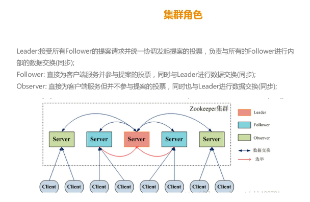
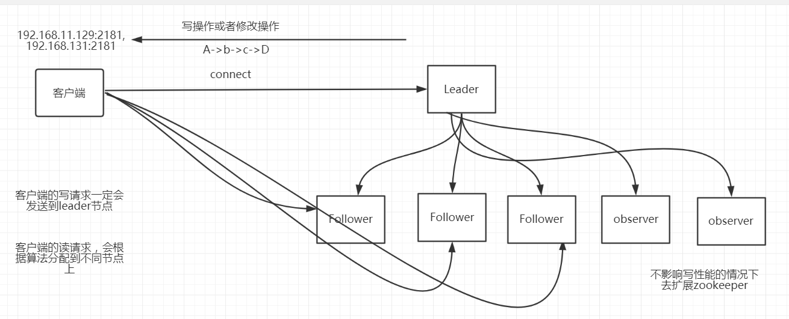

# zookeeper集群角色

zookeeper集群, 包含三种角色:

	 leader / follower /observer

###leader
leader是zookeeper集群的核心。

1. 事务请求的唯一调度者和处理者，保证集群事务处理的顺序性
2. 集群内部各个服务器的调度者

###follower
1. 处理客户端非事务请求，以及转发事务请求给leader服务器
2. 参与事务请求提议（proposal）的投票（客户端的一个事务请求，需要半数服务器投票通过以后才能通知leader commit； leader会发起一个提案，要求follower投票）
3. 参与leader选举的投票

###observer
观察zookeeper集群中最新状态的变化并将这些状态同步到observer服务器上,

增加observer不影响集群中事务处理能力，同时还能提升集群的非事务处理能力。

####observer -> 更进一步 
observer 是一种特殊的zookeeper节点。可以帮助解决zookeeper的扩展性。

observer节点的特性
	
	1、observer不参与投票（不选举leader，不对写操作投票）。
	2、只接收投票结果(需要知道哪个节点被选举为leader，从leader同步数据)。
	3、不属于zookeeper的关键部位，可提高读性能，同时不影响写性能。

高可用高性能的zookeeper集群一定会配置observer节点。

######>>>使用observer节点的好处：

如果大量客户端访问我们zookeeper集群，需要增加zookeeper集群机器数量，从而增加zookeeper集群的性能。 

如果通过不断增加follower来扩展集群，会导致zookeeper写性能下降， zookeeper的数据变更需要半数以上服务器投票通过，造成网络消耗增加投票成本。

因此，通过扩展observer节点既可以提高集群的读性能，又不会影响到集群的写性能。

######>>>配置节点作为observer
1、在zoo.cfg里面增加

	peerType=observer

2、在配置为observer的节点信息后面增加后缀 ":observer"

	server.1=192.168.11.129:2888:3888:observer

