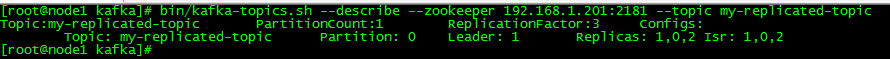

# Kafka集群安装与测试 - 版本 0.11.0.2

## 下载、安装
	cd /usr/local/software
	wget http://apache.mirror.triple-it.nl/kafka/1.0.0/kafka_2.11-1.0.0.tgz
	
	# 解压
	tar -xzf kafka_2.11-1.0.0.tgz -C /usr/local
	
	# 创建软链接
	ln -s kafka_2.11-1.0.0  kafka
	
	# 复制到其它节点
	scp -r kafka root@192.168.1.202:/usr/local
	scp -r kafka root@192.168.1.203:/usr/local

## kafka目录结构
	bin ---> 存放执行脚本
		kafka-server-start.sh
		kafka-console-producer.sh
		kafka-console-consumer.sh
		kafka-topics.sh
		kafka-server-stop.sh

	config ---> 存放配置文件
		server.properties  

	libs  ---> 存放依赖包

## 配置kafka（对集群中的3个节点进行相应修改）
修改config/server.properties
	
	# 每个broker的用来标识自己身份的唯一标识
	broker.id=0
	# 监听的IP地址和端口
	listeners=PLAINTEXT://192.168.1.201:9092
	# zk集群的连接地址
	zookeeper.connect=192.168.1.201:2181,192.168.1.202:2182,192.168.1.203:2181
	# 日志文件存放路径	
	log.dirs=/usr/local/kafka/data/kafka-logs

## 启动
	# 先确保zk集群正常启动
	/usr/local/zookeeper/bin/zkServer.sh start

	# 启动kafka（3个节点）--- 后台方式启动
	bin/kafka-server-start.sh -daemon config/server.properties

	# 停止kafka
	bin/kafka-server-stop.sh

---

## 测试

	http://kafka.apache.org/quickstart

#### >>> create a topic
create a simplest topic with only one replication

创建只有1个分区，并且该分区只有1个唯一数据副本的topic

	bin/kafka-topics.sh --create --zookeeper 192.168.1.201:2181 --replication-factor 1 --partitions 1 --topic test

#### >>> list topic
显示broker上所有的topic

	bin/kafka-topics.sh --list --zookeeper 192.168.1.201:2181

#### >>> create a new topic with a replication factor of three:
创建只有1个分区，并且该分区有3个数据副本的topic

	bin/kafka-topics.sh --create --zookeeper 192.168.1.201:2181 --replication-factor 3 --partitions 1 --topic my-replicated-topic

#### >>> how can we know which broker is doing what
显示每个broker的角色以及它的职责
bin/kafka-topics.sh --describe --zookeeper 192.168.1.201:2181 --topic my-replicated-topic

##### "leader" is the node responsible for all reads and writes for the given partition. 
leader表示对应partition的leader节点编号，上图说明brokerId=1的节点是partition 0的leader节点。

##### "replicas" is the list of nodes that replicate the log for this partition regardless of whether they are the leader or even if they are currently alive.
replicas显示partition的副本集的节点列表，上图说明brokerId=1,0,2的3个节点都存储了partition0的数据

##### "isr" is the set of "in-sync" replicas. This is the subset of the replicas list that is currently alive and caught-up to the leader.  
isr维护当前存活并且与leader的日志保持同步的所有节点集合，只有该集合内的节点才可能成为leader。
因为isr维护的是那些与leader保持数据同步状况最佳那些节点，只有这些节点在leader不可用时，才可以被选举为新的leader。如果某个数据副本节点不在isr列表中，则表示该节点的数据与leader的数据同步情况不佳。

#### >>> Send some messages 
producer发送1条消息

	bin/kafka-console-producer.sh --broker-list 192.168.1.201:9092 --topic my-replicated-topic

	> hello

#### >>> Start a consumer

# consumer接收到1条消息

	bin/kafka-console-consumer.sh --bootstrap-server 192.168.1.201:9092 --topic my-replicated-topic --from-beginning

	hello

---
### 查看kafka broker在zookeeper上注册的信息

###### 查看哪个broker成为leader，可以看到brokerId为2的节点被选举为leader。
	[zk: localhost:2181(CONNECTED) 5] get /controller
	{"version":1,"brokerid":2,"timestamp":"1518370435963"}

####### 查看broker上有哪些topic
	[zk: localhost:2181(CONNECTED) 10] ls /brokers/topics
	[awesomeTopic, test, my-replicated-topic, __consumer_offsets]

###### 查看某个topic下partition的leader是哪个节点、isr集合包含哪些节点
	[zk: localhost:2181(CONNECTED) 28] get /brokers/topics/my-replicated-topic/partitions/0/state
	{"controller_epoch":5,"leader":1,"version":1,"leader_epoch":0,"isr":[1,0,2]}

###### 查看broker维护的consumer_offset日志
	[zk: localhost:2181(CONNECTED) 47] ls /brokers/topics/__consumer_offsets/partitions
	[44, 45, 46, 47, 48, 49, 10, 11, 12, 13, 14, 15, 16, 17, 18, 19, 0, 1, 2, 3, 4, 5, 6, 7, 8, 9, 20, 21, 22, 23, 24, 25, 26, 27, 28, 29, 30, 31, 32, 33, 34, 35, 36, 37, 38, 39, 40, 41, 42, 43]

