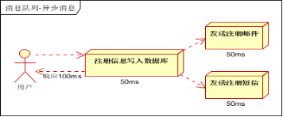
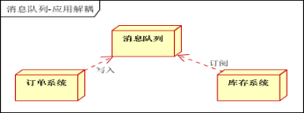
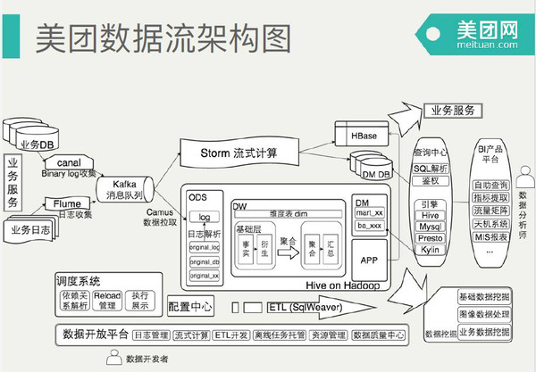

# Kafka

Kafka是一款分布式消息发布和订阅系统，具有高性能、高吞吐量的特点而被广泛应用于大数据传输场景。
它是由LinkedIn公司开发，使用Scala语言编写，之后成为Apache基金会的一个顶级项目。

### MQ的应用场景

### Kafka典型应用场景 
	应用日志收集分析
	消息系统
	用户行为分析
	运营指标（服务器性能数据）
	流式处理（spark、storm）

互联网公司在营销方面需要逐步做到精细化运营的需求，这样就能够针对不同用户的喜好推送不同的产品。而要实现这个过程就需要收集和分析用户的行为数据。而通过传统的ActiveMQ这类的消息中间件在处理大数据传输的时候存在时效性、性能、吞吐能力、消息堆积等问题。

Kafka早期设计的目的是作为LinkedIn公司的活动流和运营数据处理管道，它天然的具备了高吞吐量、内置分区、复制、容错的能力而非常适合处理大规模的消息。因此很多的大数据传输场景都选用kafka。

#### kafka在日志分析系统中的应用
应用节点非常多，产生大量日志，不便于日志的查找（业务日志、系统运行日志-bug定位）

	1、LogStash从各个节点收集日志，推送push到Kafka消息中间件；
	2、LogStash从Kafka拉取pulll消息，并对消息进行格式化处理；
	3、Logstash对日志进行格式化之后，传输到ElasticSearch中进行存储，并由ElasticSearch提供搜索功能；
	4、Kibana提供搜索入口，显示日志的搜索结果；

