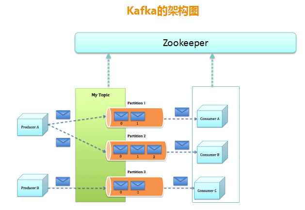
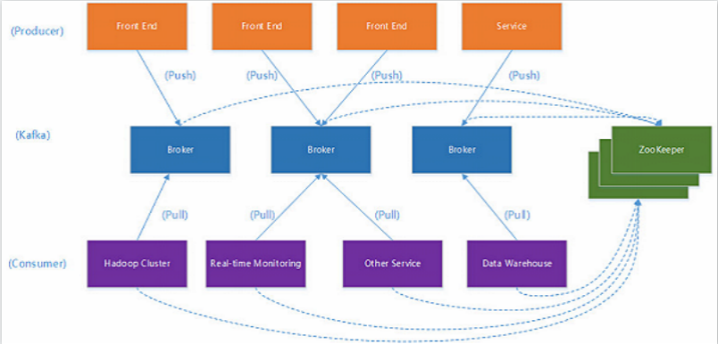
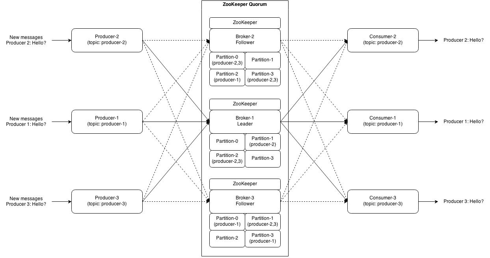

---

---

# Kafka相关名词解释
	Producer		消息生产者
	Broker			kafka消息中间件
	Topic			消息主题
	Partition		属于同一个Topic的消息被存储到不同的partition上，即消息的分片存储
	Consumer		消息消费者
	Consumer Group	消费者所属的消费组

# 核心部分
	Topic & Partition
	消息分发策略
	消息消费原理
	消息存储策略
	Partition副本机制

---

## 创建Topic，并设置该Topic的分区数(partition count)
	
#
	# 创建1个新的Topic，只有1个分区，只有1个数据副本
	> bin/kafka-topics.sh --create --zookeeper localhost:2181 --replication-factor 1 --partitions 1 --topic test

#
	# 创建1个新的Topic，并设置3个分区，每个分区一共有3个数据副本
	# 副本数与kafka集群模式中broker的个数相关
	# 3个副本则要求集群至少要有3个broker节点，因为不同的副本需要存放到不同的节点才有意义！
	> bin/kafka-topics.sh --create --zookeeper localhost:2181 --replication-factor 3 --partitions 3 --topic myTopic
	
#
	查看broker上Topic的信息：分区数、每个分区的副本数、每个分区的Leader、每个分区的isr集合
	> bin/kafka-topics.sh --describe --zookeeper localhost:2181 --topic myTopic