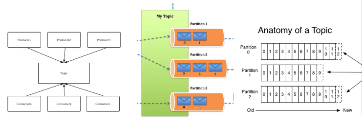
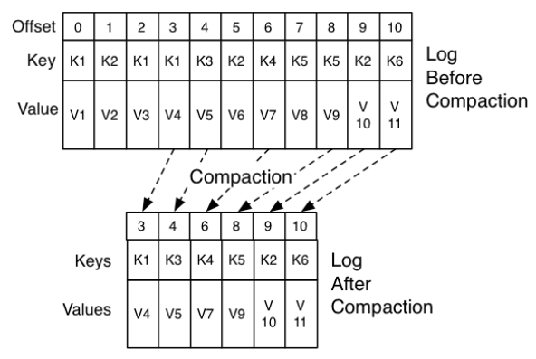
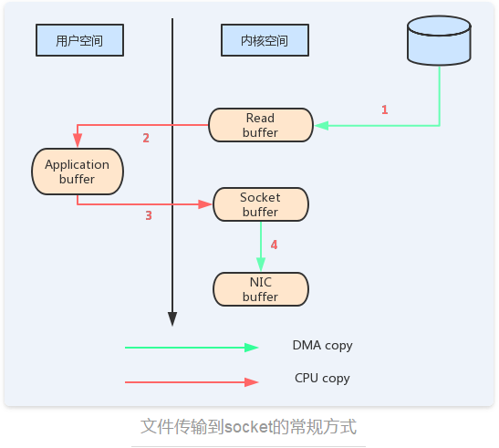
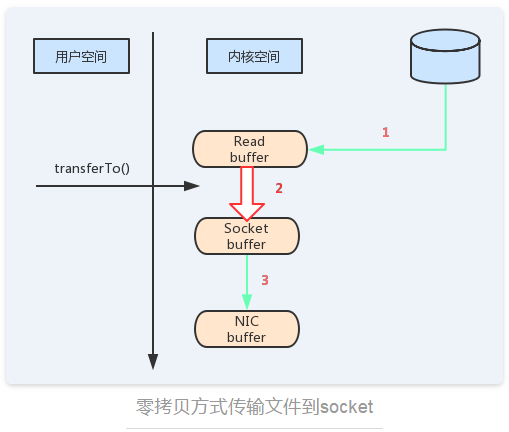
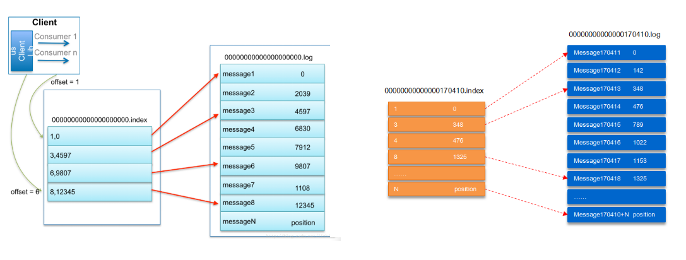
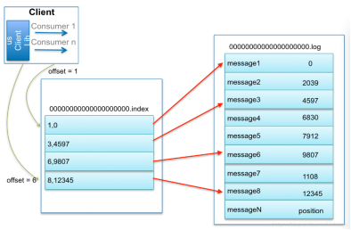
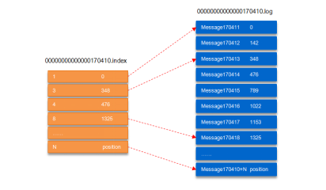
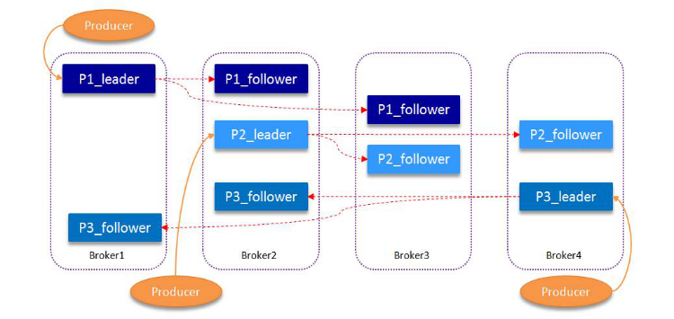
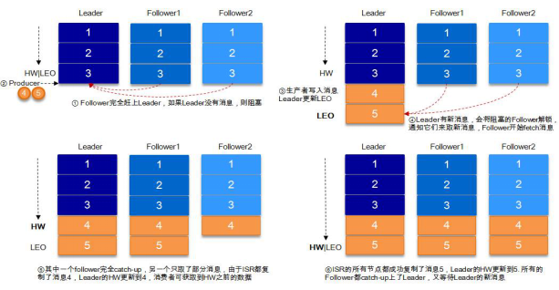

# Kafka相关名词解释
	Producer		消息生产者
	Broker			kafka消息中间件
	Topic			消息主题
	Partition		属于同一个Topic的消息被存储到不同的partition上，即消息的分片存储
	Consumer		消息消费者
	Consumer Group	消费者所属的消费组

# kafka集群架构
3个broker节点，通过zookeeper选举出1个broker作为集群的leader。

leader的信息保存在zookeeper上的/controller节点中。

---

---

---

## Topic逻辑和partition的关系
Topic是用于存储消息的逻辑统称概念，可以看作一个消息集合。

每个topic可以有多个生产者向其推送消息，也可以有任意多个消费者消费其中的消息。

每个topic可以划分多个分区（每个Topic至少有一个分区），同一topic下的不同分区包含的消息是不同的。

每个消息在被添加到分区时，都会被分配一个offset（偏移量），它是消息在此分区中的唯一编号。

kafka通过offset保证消息在分区内的顺序，offset的顺序不跨分区，即kafka只保证在同一个分区内的消息是有序的；

Partition是以文件的形式存储在文件系统中，存储在kafka-log目录下，命名规则是：
	
	<topic_name>-<partition_id>

---

## Kafka的消息的消费原理

### >>> kafka消息的组成： key + value
消息是kafka中最基本的数据单元。

消息由一串字节构成，其中主要由key和value构成，key和value也都是byte数组。

>key的主要作用是根据一定的策略，将消息路由到指定的分区中，这样就可以保证包含同一key的消息全部写入到同一个分区中。
>
因此，对于需要消息**顺序消费**的场景，则可以对不同的消息设置相同的key，来实现将消息存储到同一个partition上。

key的设计非常关键，决定了producer所发送的消息是否能均衡分配到各个partition上！

kafka分区的数据热点问题：通过对key进行优化，尽量将消息尽可能均衡分布到各个partition。

key可以是null。key为null的消息都将被存储到同一个partition上。

为了提高网络的存储和利用率，生产者会批量发送消息到kafka，并在发送之前对消息进行压缩。

### >>> 消息被路由到哪个partition的规则

kafka提供的默认Partitioner实现：

	org.apache.kafka.clients.producer.internals.DefaultPartitioner

#
	1、指定了具体的Partitioner实现类，则使用该实现类中的逻辑将消息存储到对应的partition上；
	2、没有指定Partitioner实现类，但指定了消息的key，则基于key的hashcode计算得到消息应该被存储到哪个partition上；
	3、没有指定Partitioner实现类，也没有指定消息的key，则默认使用round-robin以轮询方式将消息存储到partition上；

---
## kafka的日志策略

#### 日志保留策略
无论消费者是否已经消费了消息，kafka都会一直保存这些消息，但并不会像数据库那样长期保存。

为了避免磁盘被占满，kafka会配置相应的保留策略（retention policy），以实现周期性地删除陈旧的消息。

kafka有两种“保留策略”：

	1. 按时间：根据消息保留的时间，当消息在kafka中保存的时间超过了指定时间，就可以被删除；
	2. 按大小：根据topic存储的数据大小，当topic所占的日志文件大小大于一个阀值，则可以开始删除最旧的消息。

#### 日志压缩策略
在很多场景中，消息的key与value的值之间的对应关系是不断变化的，就像数据库中的数据会不断被修改一样，消费者只关心key对应的最新的value。我们可以开启日志压缩功能，kafka定期将相同key的消息进行合并，只保留最新的value值。

如下图所示，相同key的消息被压缩后，相同key的消息仅保留最新的。

---
## kafka的高吞吐量的因素

##### 1. 顺序写的方式存储数据 ； 

##### 2. 消息的批量发送；
在异步发送模式中。kafka允许进行批量发送，也就是producer先将消息缓存到内存中，然后一次请求批量推送到broker。

两个控制参数：

	batch.size 每批次发送的数据大小
	linger.ms  间隔时间

这样减少了磁盘频繁io以及网络IO造成的性能瓶颈

##### 3. 向客户端发送消息时，数据的零拷贝优化 - java  Files.transferTo(...)
消息从发送到落地保存，broker维护的消息日志本身就是文件目录，每个文件都是二进制保存，生产者和消费者使用相同的格式来处理。

在消费者获取消息时，服务器先从硬盘读取数据到内存，然后把内存中的数据原封不懂的通过socket发送给消费者。

虽然这个操作描述起来很简单，但实际上经历了很多步骤

> 常规文件拷贝
	
	▪ 操作系统将数据从磁盘读入到内核空间的页缓存
	▪ 应用程序将数据从内核空间读入到用户空间缓存中
	▪ 应用程序将数据写回到内核空间到socket缓存中
	▪ 操作系统将数据从socket缓冲区复制到网卡缓冲区，以便将数据经网络发出

>**零拷贝技术**
>
通过“零拷贝”技术可以去掉这些没必要的数据复制操作，同时也会减少上下文切换次数
零拷贝的前提：
应用程序不需要对数据进行修改，仅仅是将磁盘上的文件原封不动的发送给其它网络节点。

---

## Kafka消息的文件存储机制 - 分片存储、冗余副本
#####高性能/高吞吐量：
	数据分片存储 + 高效写（数据顺序写磁盘） + 高效读（日志分段 + 日志offset索引）

#####高可用：
	数据冗余副本

## Kafka消息的文件存储机制
在kafka文件存储中，同一个topic下有多个不同的partition，每个partition为一个目录，partition的名称规则为：topic名称+有序序号，第一个序号从0开始，最大的序号为partition数量减1，partition是实际物理上的概念，而topic是逻辑上的概念。

##### partition还可以细分为segment，这个segment是什么呢？

假设kafka以partition为最小存储单位，那么我们可以想象当kafka producer不断发送消息，必然会引起partition文件的无限扩张，这样对于消息文件的维护以及被消费的消息的清理带来非常大的挑战，所以kafka 以segment为单位又把partition进行细分。每个partition相当于一个巨型文件被平均分配到多个大小相等的segment数据文件中（每个setment文件中的消息不一定相等），这种特性方便已经被消费的消息的清理，提高磁盘的利用率。

##### segment file组成：
由2大部分组成，分别为index file和data file，此2个文件一一对应，成对出现，后缀".index"和“.log”分别表示为segment索引文件、数据文件。

##### segment文件命名规则：
partion全局的第一个segment从0开始，后续每个segment文件名为上一个segment文件最后一条消息的offset值。数值最大为64位long大小，19位数字字符长度，没有数字用0填充。	

##### 高效的数据查找方式
	index -> offset -> log

以上图为例，读取offset=170418的消息，首先查找segment文件，其中00000000000000000000.index为最开始的文件，第二个文件为00000000000000170410.index（起始偏移为170410+1=170411），而第三个文件为00000000000000239430.index（起始偏移为239430+1=239431），所以这个offset=170418就落到了第二个文件之中。

其他后续文件可以依次类推，以起始偏移量命名并排列这些文件，然后根据二分查找法就可以快速定位到具体文件位置。

其次根据00000000000000170410.index文件中的[8,1325]定位到00000000000000170410.log文件中的1325的位置进行读取。

**日志按大小进行分段存储（日志滚动），好处是：便于日志的管理与压缩，还可以提高消息检索速度。**

	稀疏索引 + 控制单个日志文件大小 =》提高文件检索的效率

两个重要到文件：

	原始消息日志	00000****.log
	原始消息日志的索引文件  00000****.index

初始日志，从00000000000000开始编号

随着消息的不断堆积，日志累计过程中会发生分段，于是生成新的日志文件

---
## 高可用副本机制 - leader election

在kafka引入replication机制以后，同一个partition会有多个Replica。

那么在这些replication之间需要选出一个Leader，Producer或者Consumer只与这个Leader进行交互，其他的Replica作为Follower从leader中复制数据（因为需要保证一个Partition中的多个Replica之间的数据一致性，其中一个Replica宕机以后其他的Replica必须要能继续提供服务且不能造成数据重复和数据丢失）。

如果没有leader，所有的Replica都可以同时读写数据，那么就需要保证多个Replica之间互相同步数据，数据一致性和有序性就很难保证，同时也增加了Replication实现的复杂性和出错的概率。
在引入leader以后，leader负责数据读写，follower只向leader顺序fetch数据，简单而且高效。

##### 如何将所有的Replica均匀分布到整个集群

为了更好的做到负载均衡，kafka尽量会把所有的partition均匀分配到整个集群上。如果所有的replica都在同一个broker上，那么一旦broker宕机所有的Replica都无法工作。kafka分配Replica的算法

	1. 把所有的Broker（n）和待分配的Partition排序
	2. 把第i个partition分配到 （i mod n）个broker上
	3. 把第i个partition的第j个Replica分配到 ( (i+j) mod n) 个broker上

##### 如何处理所有的Replica不工作的情况
在**ISR集合**中至少有一个follower时，Kafka可以确保已经commit的数据不丢失，但如果某个Partition的所有Replica都宕机了，就无法保证数据不丢失了。

	1. 等待ISR中的任一个Replica“活”过来，并且选它作为Leader ---- 一致性
	2. 选择第一个“活”过来的Replica（不一定是ISR中的）作为Leader  ---- 可用性

这就需要在可用性和一致性当中作出一个简单的折衷。

如果一定要等待ISR中的Replica“活”过来，那不可用的时间就可能会相对较长。而且如果ISR中的所有Replica都无法“活”过来了，或者数据都丢失了，这个Partition将永远不可用。

选择第一个“活”过来的Replica作为Leader，而这个Replica不是ISR中的Replica，那即使它并不保证已经包含了所有已commit的消息，它也会成为Leader而作为consumer的数据源（前文有说明，所有读写都由Leader完成）。

Kafka0.8.*使用了第二种方式。
Kafka支持用户通过配置选择这两种方式中的一种，从而根据不同的使用场景选择高可用性还是强一致性。

#### 副本同步细节分析 - ISR（副本同步队列）
ISR：ISR表示目前**“可用且消息量与leader相差不多”**的副本集合，这是整个副本集合的一个子集。
维护的是有资格提升为leader的follower节点。

	1. 副本的所有节点都必须要和zookeeper保持连接状态。
	2. 副本的最后一条消息的offset和leader副本的最后一条消息的offset之间的差值不能超过指定的阀值，这个阀值是可以设置的（replica.lag.max.messages）。

###### HW&LEO --- HW(High Watermark)和LEO(Log End Offset)

关于follower副本同步的过程中，还有两个关键的概念，**HW(HighWatermark)**和**LEO(Log End Offset)**. 这两个参数跟ISR集合紧密关联。

**HW标记了一个特殊的offset，当消费者处理消息的时候，只能拉去到HW之前的消息，HW之后的消息对消费者来说是不可见的。**也就是说，取partition对应ISR中最小的LEO作为HW，consumer最多只能消费到HW所在的位置。

每个replica都有HW，leader和follower各自维护更新自己的HW的状态。
对于leader新写入的消息，consumer不能立刻消费，leader会等待该消息被所有ISR中的replicas同步更新HW，此时消息才能被consumer消费。这样就保证了如果leader副本损坏，该消息仍然可以从新选举的leader中获取。

----这里引申出一个结论：如果设置的副本数太多，消息被consumer消费的时效性就会降低！！！

**LEO 是所有副本都会有的一个offset标记，它指向追加到当前副本的最后一个消息的offset。**

当生产者向leader发送新的消息的时候，leader副本的LEO标记就会递增；当follower副本成功从leader副本拉去消息并更新到本地的时候，follower副本的LEO就会增加。

副本消息复制过程中，通过hw和leo来标记消息在各个副本中的状态：

