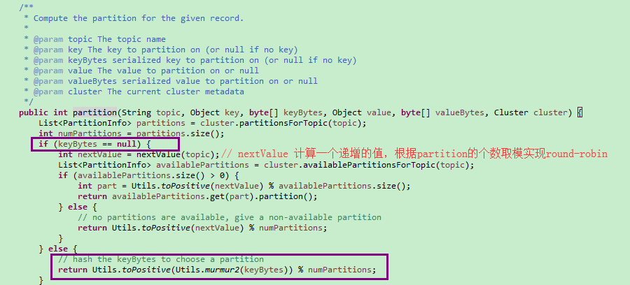

# producer 生产者向指定Topic发送消息
## 生产者关键的配置参数
	【kafka集群的地址】
		> brokerlist	配置Kafka集群的连接地址
	
	【生产者的唯一标识】	
	 	> producer.id	每个生产者都有自己的唯一标识ID

	【序列化的参数】
		> key.serializer		消息的key的序列化方式
		> value.serializer	消息的value的序列化方式
	
	【消息安全到达的控制参数】
		> acks  - 发送的消息被broker确认的方式 
		acks=0, 消息只要加入到sendbuffer，就认为发送成功（消息丢失可能性很大）
		acks=1, 消息被partition的leader接收并写入本地log就返回成功（未与follower同步，有可能丢失消息）
		acks=all，消息被leader接收，leader与isr集合的follower完成同步才返回成功（消息丢失几率最小，但影响消息发送的性能） 
	
	【吞吐量相关的控制参数】
		> batch.size	- 批量大小
		producer为每个partition维护一个缓冲队列，达到一定条件时再进行批量提交。 设置为0将关闭批量模式。
		
		> linger.ms	- 发送延迟时间
		类似Nagle's algorithm in TCP，避免大量小数据包在网络上传输。在该时间段内会累积消息，等时间到了才发送出去。

### 生产端的发送模式
	【同步发送】
		返回结果是 RecordMetadata

	【异步发送】
		返回结果是 Future<RecordMetadata>，一般通过Callback来处理响应。

### 注意：
	生产端producer往不存在的Topic上发送消息，将自动创建topic。
	自动创建的这个Topic只有1个分区，1个副本。

### 消息的路由策略
	### >>> kafka消息的组成： key + value
消息是kafka中最基本的数据单元。

消息由一串字节构成，其中主要由key和value构成，key和value也都是byte数组。

>key的主要作用是根据一定的策略，将消息路由到指定的分区中，这样就可以保证包含同一key的消息全部写入到同一个分区中。
>
因此，对于需要消息**顺序消费**的场景，则可以对不同的消息设置相同的key，来实现将消息存储到同一个partition上。

key的设计非常关键，决定了producer所发送的消息是否能均衡分配到各个partition上！

kafka分区的数据热点问题：通过对key进行优化，尽量将消息尽可能均衡分布到各个partition。

key可以是null。key为null的消息都将被存储到同一个partition上。

为了提高网络的存储和利用率，生产者会批量发送消息到kafka，并在发送之前对消息进行压缩。

#### >>> 消息被路由到哪个partition的规则

kafka提供的默认Partitioner实现（可以自定义实现partition策略）：

	org.apache.kafka.clients.producer.internals.DefaultPartitioner

#
	1、指定了具体的Partitioner实现类，则使用该实现类中的逻辑将消息存储到对应的partition上；
	2、没有指定Partitioner实现类，但指定了消息的key，则基于key的hashcode计算得到消息应该被存储到哪个partition上；
	3、没有指定Partitioner实现类，也没有指定消息的key，则默认使用round-robin以轮询方式将消息存储到partition上；

---

## kafka 消息可靠性机制

#### 消息发送可靠性
生产者发送消息到broker，broker向producer提供的消息确认方式（request.required.acks）：

	acks = 0: producer不会等待broker（leader）响应ack 。
	因为发送消息网络超时或broker crash，消息既有可能丢失也可能会重发。

	acks = 1: 当leader接收到消息之后就响应ack，丢的概率很小

	acks = -1: 当所有的follower都同步消息成功后才响应ack.  丢失消息可能性比较低。效率也很低。

#### 消息存储可靠性

	1、数据分片-消息存储的水平可扩展 partition

	2、分片副本-replicas
	每一条消息被发送到broker中，会根据partition规则选择被存储到哪一个partition。

如果partition规则设置的合理，所有消息可以均匀分布到不同的partition里，这样就实现了水平扩展。

在创建topic时可以指定这个topic对应的partition的数量。

在发送一条消息时，可以指定这条消息的key，producer根据这个key和partition机制来判断这个消息发送到哪个partition。

kafka的高可靠性的保障来自于另一个叫副本（replication）策略，通过设置副本的相关参数，可以使kafka在性能和可靠性之间做不同的切换。

》》》创建高可靠性的副本

	--partitions 表示topic的分区数
	--replication-factor 表示每个分区的副本数
	sh kafka-topics.sh --create --zookeeper 192.168.11.140:2181 --replication-factor 2 --partitions 3 --topic myTopic