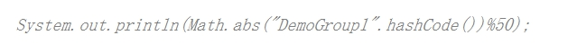
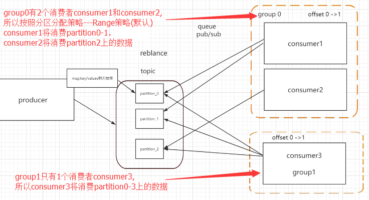

# kafka消息消费模式 - 基于consumerGroup 实现（队列、主题）的消费场景

---
## consumer pull
consumer消费消息时，通过offset从broker上定位消息的位置，拉取消息进行消费；

**注意： Kafka只提供了Topic的消息模型，没有提供传统Queue的消息模型。**

	使用高层API（推荐）：
	消费端按broker上记录的offset来获取消息（kafka对每个group消费消息offset进行了记录）。
	消息的offset完全由kafka来维护，客户端只需要拉取消息即可。

	使用底层API：
	消息的offset位置需要由消费端来维护，消费端告诉broker从哪个partition的哪个offset开始获取消息。
	由于复杂性较高，需要处理大量的细节，因此一般情况下不建议使用底层API。

---
##consumerGroup的设计思想：
	基于group来维护每个组的消息偏移位置offset。
	
	每个consumer都需要绑定到某个group上，即每个consumer有一个所属的group；
	
	每个group在broker上都有一个日志文件（__consumer_offset_x）来维护该group当前消息的offset；
	
	每次消费从对应group的offset位置开始消费消息；
	
	每当consumer消费成功一条消息，broker就会对group的消息偏移量offset做加1操作；

---
### 队列Queue --- 基于Topic来实现Queue 队列的功能

同一个Group下的consumer，同一个消息仅被其中某个consumer消费。

	kafka提供了partition上消息的有序消费支持，但不保障消息的全局顺序消费。

	【底层原理】
		生产者将消息发送到某个Topic上；
		Topic基于分区策略绑定到了N个partition，生产者发往该Topic的消息会被broker基于消息的key将消息路由到某个partition上进行存储；
		
		消费者消费消息时，kafka会将该Topic下的partition基于range策略，将不同的partition分配给不同的consumer进行消费，每个消费端所处理的消息是来自不同的partition的。

		如果group下只有1个consumer，则该Topic下所有partition上的消息都会分配给该consumer进行消费；

		基于上述原理，不同的consumer处理来自不同partition上的消息，同一个消息只会被同组内的唯一个consumer消费。
 
### 主题Topic --- 基于Topic来实现发布/订阅的功能
	不同group的consumer，彼此消费的消息互不影响；

	【底层原理】
	kafka会将对每个group的名称进行hash取模运算，然后根据得到的数值将group所消费的消息offset存储到__consumer_offset_x日志文件中保存。

	由于不同名称的group，其消费消息的offset是独立的，所以同一个消息可以被不同group内的consumer所消费。

---

## kafka 消息可靠性机制

#### 消息发送可靠性
生产者发送消息到broker，broker向producer提供的消息确认方式（request.required.acks）：

	acks = 0: producer不会等待broker（leader）响应ack 。
	因为发送消息网络超时或broker crash，消息既有可能丢失也可能会重发。

	acks = 1: 当leader接收到消息之后就响应ack，丢的概率很小

	acks = -1: 当所有的follower都同步消息成功后才响应ack.  丢失消息可能性比较低。效率也很低。

#### 消息存储可靠性

	1、数据分片-消息存储的水平扩展 partion

	2、分片副本-replicas
	每一条消息被发送到broker中，会根据partition规则选择被存储到哪一个partition。

如果partition规则设置的合理，所有消息可以均匀分布到不同的partition里，这样就实现了水平扩展。

在创建topic时可以指定这个topic对应的partition的数量。

在发送一条消息时，可以指定这条消息的key，producer根据这个key和partition机制来判断这个消息发送到哪个partition。

kafka的高可靠性的保障来自于另一个叫副本（replication）策略，通过设置副本的相关参数，可以使kafka在性能和可靠性之间做不同的切换。

》》》创建高可靠性的副本

	--partitions 表示topic的分区数
	--replication-factor 表示每个分区的副本数
	sh kafka-topics.sh --create --zookeeper 192.168.11.140:2181 --replication-factor 2 --partitions 3 --topic myTopic

---
## Kafka的消息的消费原理

##### kafka历史版本-使用zk记录consumer group的offset偏移信息
之前Kafka存在的一个非常大的性能隐患就是利用ZK来记录各个Consumer Group的消费进度（offset）。当然JVM Client帮我们自动做了这些事情，但是Consumer需要和ZK频繁交互，而利用ZK Client API对ZK频繁写入是一个低效的操作，并且从水平扩展性上来讲也存在问题。所以ZK抖一抖，集群吞吐量就跟着一起抖，严重的时候简直抖的停不下来。

##### kafka新版本-使用kafka内部日志文件保存offset偏移信息
新版Kafka已推荐将consumer的位移信息保存在Kafka内部的topic中，即__consumer_offsets topic。__consumer_offsets_topic默认有50个分区，分区个数可以调整。

**__consumer_offsets_N 维护consumer group的消费偏移量**

通过以下操作来看看__consumer_offsets_topic是怎么存储消费进度的：
	1. 计算consumer group对应的hash值

	2. 获得consumer group的位移信息
	bin/kafka-simple-consumer-shell.sh --topic __consumer_offsets --partition 17 -broker-list 192.168.1.201:9092,192.168.1.202:9092,192.168.1.203:9092 --formatter kafka.coordinator.group.GroupMetadataManager\$OffsetsMessageFormatter

#### 分区分配策略
1个Topic下存在多个分区，1个consumer group内存在若干个consumer，consumer根据什么规则消费消息？

	1、consumer group内只有1个consumer，则所有分区上的消息都由该consumer进行消费。
	2、consumer group内consumer的个数与分区数相同，则每个consumer消费1个分区上的消息。
	3、consumer group内consumer的个数大于分区数，则会造成多余的consumer空闲，浪费资源。

---
	

## 问：相同Group下的多个consumer如何分配partition上的数据？
在kafka中每个topic一般都会有很多个partitions。
为了提高消息的消费速度，我们可能会启动多个consumer去消费； 
同时，kafka存在consumer group的概念，也就是group.id一样的consumer，这些consumer属于一个consumer group，组内的所有消费者协调在一起来消费消费订阅主题的所有分区。

那么同一个consumer group里面的consumer是怎么去分配该消费哪个分区里的数据？
这个就涉及到了kafka内部**分区分配策略（Partition Assignment Strategy）**

#### 在 Kafka 内部存在两种分区分配策略：
Range（默认） 和 RoundRobin。

通过：partition.assignment.strategy指定，默认是range策略。也可以指定分区分配策略。

##### 两种分区分配策略
	1、Range 策略（默认）
	0 ，1 ，2 ，3 ，4，5，6，7，8，9
	算法：10(partition num/3(consumer num) =3
	c0 [0...3] 	按范围将分区指派给consumer，因此编号从0到3的partition分配给了c0消费者
	c1 [4...6] 
	c2 [7...9]

#
	2、Roundrobin 策略
	0 ，1 ，2 ，3 ，4，5，6，7，8，9
	算法：按分配编号轮询分配。
	c0  [0,3,6,9]   按轮询策略进行分配，因此c0消费者被依次分配了编号为0,3,6,9的partition
	c1  [1,4,7]
	c2  [2,5,8]

#### consumer rebalance （重要）
kafka会实时根据consumer group中消费者的个数的变化，或者partition的变化，对分区消息的消费进行再平衡，保持partition上的消息可以被高效的消费。

当以下事件发生时，Kafka 将会进行一次分区分配的更新：

	1. 同一个consumer group内新增了消费者
	2. 消费者离开当前所属的consumer group，包括shuts down 或crashes
	3. 订阅的主题新增分区（分区数量发生变化）
	4. 消费者主动取消对某个topic的订阅
	5. 也就是说，把分区的所有权从一个消费者移到另外一个消费者上，这个是kafka consumer 的rebalance机制。如何rebalance就涉及到前面说的分区分配策略。

