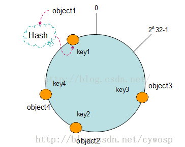
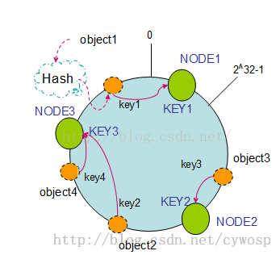
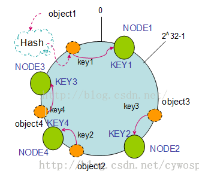

# 分布式缓存： 一致性hash算法

---
## 分布式缓存的设计
缓存作为数据库前的一道屏障，它的可用性与缓存命中率都会直接影响到数据库，所以除了配置主从保证高可用之外还需要设计分布式缓存来扩充缓存的容量，将数据分布在多台机器上如果有一台不可用了对整体影响也比较小。

缓存的分布式集群和应用服务器不同，缓存的分布式是每台机器上的缓存数据是不一样的，不像应用服务器是无状态的，每台机器上的服务是一致的。

访问缓存的请求不可以在缓存服务器集群中的任意一台进行处理，必须根据某种算法对缓存key进行映射，从而找到缓存有需要数据的服务器。

## 分布式缓存面对的问题
缓存集群在新上线机器和删除机器的时候，将会导致集群中部分缓存失效。

要尽量将缓存失效的范围限制到最小，该如何做呢？

## Hash 余数算法
如何选择到正确的服务器需要使用好的路由算法，下面以简单的余数Hash算法为例来选择服务器：

首先用缓存数据的key的hash值除以缓存服务器的数目，得到的余数就是集群服务器列表的下标。

这样就可以定位到正确的服务节点。

比如有3台服务器，node1,node2,node3对应在服务器列表编号为1，2，3。

key为“Hello”的缓存查询请求来了之后，计算Hello的Hash值，假如为23432113，除以3余数假如是1，那就说明数据在node1上。

这种算法能否保证各服务节点保存的数据量大致相同完全依赖于key的hash值是否够分散。

所以通常不会直接使用java对象的hashCode()，这个方法计算出来的值不够分散，而是先计算出对象的MD5值然后再调用hashCode()。

问题来了，假如新增一台机器，3台扩展到4台，这时候的除数变为4了，之前机器计算出来的余数都和之前不一致了，也就是说再也不能正确命中到缓存服务器，请求就直接到达数据库，大大增加了数据库的负载能力。

针对这个问题一种解决办法是在网站访问量最少的时候扩容服务器，然后通过模拟请求的方法对缓存进行预热，使得数据在缓存服务器中重新分布。

当然这种方案有点low，另外一种方法是改进路由算法，使得新加入的服务器不影响大部分缓存数据的正确命中。目前比较流行的就是一致性Hash算法。

## 缓存集群扩容导致缓存失效如何解决？ --- hash环
一致性Hash算法大致过程：

1，先构造一个长度为2^32的整数环（称为一致性Hash环，分布范围为[0，2^32-1]）

2，根据节点名称（例如IP或机器名）的Hash值放置在这个Hash环上。

3，然后根据需要缓存的数据的key值计算出Hash值，同样也分布在Hash环上。

4，当取缓存时，根据key算出Hash，然后顺时针查找离这个Hash值最近的服务节点，这个缓存值就保存在这个节点中。

一致性Hash算法可以使用二叉查找树来实现，Hash查找的过程实际上就是在二叉树中查找不小于查找数的最小数值，二叉树最右边叶子节点和最左边的叶子节点相连接，就可以造成环状的数据结构。在Java中就可以利用TreeMap轻松实现。

如上图所示，Hash(object1)=key1；Hash(object2)=key2；Hash(object3)=key3；Hash(object4)=key4；分别分布在Hash环上。如果有三台机器，Hash(NODE1) = KEY1;Hash(NODE2) = KEY2;Hash(NODE3) = KEY3;

所以就如下图所示，key1找到的是KEY1也就是NODE1；key2找到的是KEY3也就是NODE3；key3找到的是KEY2也就是NODE2；key4找到的是KEY3也就是NODE3。

这时如果新增了一台NODE4，其Hash为KEY4，假如在Hash环上分布如下，那么key2不再找KEY3了，找的是KEY4。

新增机器后，key1,key3,key4找的机器相比之前没有变化。也就是说这种算法能保证之前缓存的大部分数据还能继续被命中，优于取余数的Hash算法。但这个算法还是有一个问题，就是key2被命中到KEY4上了，NODE3有效数据被减少了，如果缓存数据量相当大的时候，会造成集群上的各个服务器之间的不平衡。

解决这种不平衡的方式是引入虚拟节点。

## 虚拟节点
虚拟节点是根据每一台真实节点而来的，假如NODE1的ip是10.0.0.1，我们不再使用这个IP直接计算Hash值放在Hash环上了。

而是使用多个10.0.0.1#1、10.0.0.1#2 ......10.0.0.1#N计算多个Hash值放在Hash环上。

这样就相当于给真实节点扩充了N个虚拟节点。

这时再加一台机器就相当于要往Hash环上放N个节点，这N个节点会均衡分布在环上。

这会给之前每个key值的指向都会产生变化，也就是相当于把变化的指向扩散给环上的多个节点去承担了。这样就保证了算法的平衡性。