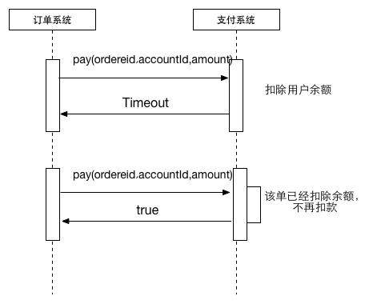
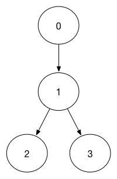

# 分布式系统接口幂等性

现在简化为这样一个系统，用户购买商品的订单系统与支付系统；订单系统负责记录用户的购买记录已经订单的流转状态（orderStatus),支付系统用于付款，提供

	boolean pay(int accountid,BigDecimal amount) //用于付款，扣除用户的

接口，订单系统与支付系统通过分布式网络交互。

这种情况下，支付系统已经扣款，但是订单系统因为网络原因，没有获取到确切的结果，因此订单系统需要重试。

由上图可见，支付系统并没有做到接口的幂等性，订单系统第一次调用和第二次调用，用户分别被扣了两次钱，不符合幂等性原则（同一个订单，无论是调用了多少次，用户都只会扣款一次）。

如果需要支持幂等性，付款接口需要修改为以下接口：
	
	boolean pay(int orderId,int accountId,BigDecimal amount)

通过orderId来标定订单的唯一性，付款系统只要检测到订单已经支付过，则第二次调用不会扣款而会直接返回结果：

	

在不同的业务中不同接口需要有不同的幂等性，特别是在分布式系统中，因为网络原因而未能得到确定的结果，往往需要支持接口幂等性。

# 分布式系统接口幂等性 (update by status)

随着分布式系统及微服务的普及，因为网络原因而导致调用系统未能获取到确切的结果从而导致重试，这就需要被调用系统具有幂等性。

例如上文所阐述的支付系统，针对同一个订单保证支付的幂等性，一旦订单的支付状态确定之后，以后的操作都会返回相同的结果，对用户的扣款也只会有一次。

这种接口的幂等性，简化到数据层面的操作：

	update userAmount set amount = amount - 'value' ,paystatus = 'paid' where orderId= 'orderid' and paystatus = 'unpay'

其中value是用户要减少的订单，paystatus代表支付状态，paid代表已经支付，unpay代表未支付，orderid是订单号。

在上文中提到的订单系统，订单具有自己的状态（orderStatus),订单状态存在一定的流转。订单首先有提交（0），付款中（1），付款成功（2），付款失败（3），简化之后其流转路径如图：

	

当orderStatus = 1 时，其前置状态只能是0，也就是说将orderStatus由0->1 是需要幂等性的

	update Order set orderStatus = 1 where OrderId = 'orderid' and orderStatus = 0

当orderStatus 处于0，1两种状态时，对订单执行0->1 的状态流转操作应该是具有幂等性的。

这时候需要在执行update操作之前检测orderStatus是否已经=1，如果已经=1则直接返回true即可。

但是如果此时orderStatus = 2,再进行订单状态0->1 时操作就无法成功，但是幂等性是针对同一个请求的，也就是针对同一个requestid保持幂等。

这时候再执行

	update Order set orderStatus = 1 where OrderId = 'orderid' and orderStatus = 0

接口会返回失败，系统没有产生修改，如果再发一次，requestid是相同的，对系统同样没有产生修改。