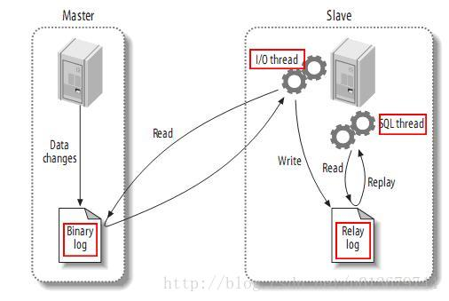

# MySQL的主从同步复制原理

一般的主从基本都是同步/异步方式进行日志的复制，达成最终一致性。

复制过程中一个服务器充当主服务器，而一个或多个其它服务器充当从服务器。主服务器将更 新写入二进制日志文件，并维护文件的一个索引以跟踪日志循环。这些日志可以记录发送到从服务器的更新。当一个从服务器连接主服务器时，它通知主服务器从服 务器在日志中读取的最后一次成功更新的位置。从服务器接收从那时起发生的任何更新，然后封锁并等待主服务器通知新的更新。

####MySQL主从复制的3个主要步骤：

	(1)  master将改变记录到二进制日志(binary log)中（这些记录叫做二进制日志事件，binary log events）；
	(2)  slave将master的binary log events拷贝到它的中继日志(relay log)；
	(3)  slave重做中继日志中的事件，将改变反映它自己的数据。

该过程的第一部分就是master记录二进制日志。在每个事务更新数据完成之前，master在二日志记录这些改变。MySQL将事务串行的写入二进制日 志，即使事务中的语句都是交叉执行的。在事件写入二进制日志完成后，master通知存储引擎提交事务。

下一步就是slave将master的binary log拷贝到它自己的中继日志。首先，slave开始一个工作线程——I/O线程。I/O线程在master上打开一个普通的连接，然后开始binlog dump process。Binlog dump process从master的二进制日志中读取事件，如果已经跟上master，它会睡眠并等待master产生新的事件。I/O线程将这些事件写入中继日志。

SQL slave thread（SQL从线程）处理该过程的最后一步。SQL线程从中继日志读取事件，并重放其中的事件而更新slave的数据，使其与master中的数 据一致。只要该线程与I/O线程保持一致，中继日志通常会位于OS的缓存中，所以中继日志的开销很小。

此外，在master中也有一个工作线程：和其它MySQL的连接一样，slave在master中打开一个连接也会使得master开始一个线程。复制 过程有一个很重要的限制——复制在slave上是串行化的，也就是说master上的并行更新操作不能在slave上并行操作。