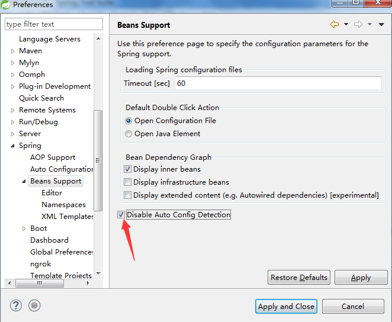

# Eclipse Crashes (Not Responding)  “populate auto detected configs”

I had a similar issue and I've resolved disabling auto config in Spring plugin.

In Eclipse, open: 
	Windows > Preferences > Spring > Bean Supports Check the option Disable Auto Config Detection.

